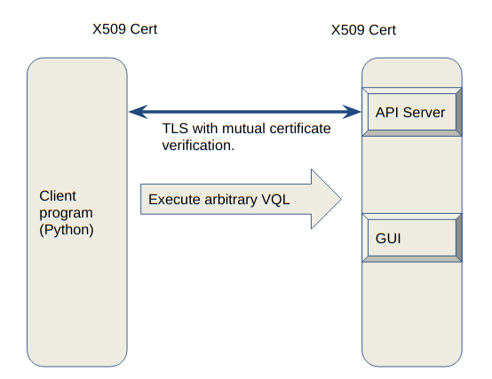
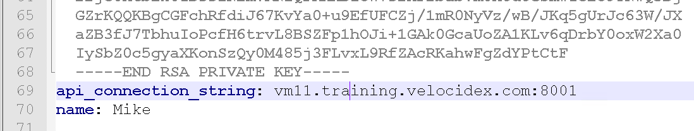

<!-- .slide: class="title " -->


# Automating the Velociraptor Server


---

<!-- .slide: class="content " -->

## Server artifacts

* Server automation is performed by exporting server administration
  functions as VQL plugins and functions
* This allows the server to be controlled and automated using VQL queries
* Server artifacts encapsulate VQL queries to performs certain actions
* Server monitoring artifacts watch for events on the server and respond.

---

<!-- .slide: class="content " -->

## Example: Client version distribution

* 30 Day active client count grouped by version

```
SELECT count() AS Count, agent_information.version AS Version
FROM clients()
WHERE timestamp(epoch=last_seen_at) > now() - 60 * 60 * 24 * 30
GROUP BY Version
```

---

<!-- .slide: class="content " -->
## Server concepts

* `Client`: A Velociraptor instance running on an endpoint. This is
  denoted by client_id and indexed in the client index.
* `Flow`: A single artifact collection instance. Can contain multiple
  artifacts with many sources each uploading multiple files.
* `Hunt`: A collection of flows from different clients. Hunt results
consist of the results from all the hunt's flows

---

<!-- .slide: class="content small-font" -->

## Exercise - label clients

* Label all windows machines with a certain local username.

1. Launch a hunt to gather all usernames from all endpoints
2. Write VQL to label all the clients with user "mike"

This can be used to label hosts based on any property of grouping that makes sense.
Now we can focus our hunts on only these machines.

---

<!-- .slide: class="content small-font" -->

## Exercise - label clients with event query

* The previous method requires frequent hunts to update the labels -
  what if a new machine is provisioned?

* Label all windows machines with a certain local username using an
event query.

---

<!-- .slide: class="content small-font" -->

## Server management with VQL

* We use the offline collector frequently to facilitate collections on
  systems we have no access to.

* Write a server event query to automatically import new collections
  uploaded to:

  1. A Windows Share
  2. An S3 bucket.

---

<!-- .slide: class="title " -->

# The Velociraptor API

## Controlling the beast!

---

<!-- .slide: class="content " -->

## Why an API?

* Velociraptor needs to plug into a much wider ecosystem

* Velociraptor can itself control other systems
    * Can already be done by the `execve()` and `http_client()` VQL
      plugins.

* Velociraptor can be controlled by external tools
    * Allows external tools to enrich and automate Velociraptor
    * This is what the API is for!

---

<!-- .slide: class="full_screen_diagram" -->

### Velociraptor API Server overview



---

<!-- .slide: class="content " -->

## Velociraptor API Server overview

* TLS authentication occurs through pinned certificates - both client
  and server are mutually authenticated and must have certificates
  issued by Velociraptor's trusted CA.
* Execute arbitrary VQL

---

<!-- .slide: class="content " -->

## The Velociraptor API
* The API is extremely powerful so it must be protected!
* The point of an API is to allow a client program (written in any
  language) to interact with Velociraptor.
* The server mints a certificate for the client program to use. This
  allows it to authenticate and establish a TLS connection with the
  API server.
* By default the API server only listens on 127.0.0.1 - you need to
  reconfigure it to open it up.

---

<!-- .slide: class="content " -->

## Create a client API certificate

```
velociraptor --config server.config.yaml  --config server.config.yaml
   config api_client --name Mike --role administrator api_client.yaml
```

* Update the API connection string if needed.



---

<!-- .slide: class="content " -->

## Grant access to API key

* The API key represents a user so you can manage access through the
  normal user management GUI
    * To be able to call into the API the user needs the `api` role.

* Access to push events to an artifact queue:
    * Allows an API client to publish an event to one of the event
      queues.

```
velociraptor --config /etc/velociraptor/server.config.yaml
   acl grant Mike '{"publish_queues": ["EventArtifact1", "EventArtifact2"]}'
```

---

<!-- .slide: class="content " -->

## Export access to your API

* Normally Velociraptor is listening on the loopback interface only
* If you want to use the API from external machines, enable binding to
  all interfaces

```yaml
API:
  hostname: 192.168.1.11
  bind_address: 0.0.0.0
  bind_port: 8001
  bind_scheme: tcp
  pinned_gw_name: GRPC_GW
```

---

<!-- .slide: class="content small-font" -->

## Using the API to connect to the server.

* The velociraptor binary can use the API directly to connect to a
  remote server:

```
velociraptor --api_config api_client.yaml query "SELECT * FROM info()"
```

* Using Python for example

```
pip install pyvelociraptor
pyvelociraptor --config api_client.yaml "SELECT * FROM info()"
```

---

<!-- .slide: class="content small-font" -->
## Schedule an artifact collection

* You can use the API to schedule an artifact collection

```sql
LET collection <= collect_client(
   client_id='C.cdbd59efbda14627', artifacts='Generic.Client.Info', args=dict())
```

* This just schedules the collection - remember the client may be
  offline for an indefinitely long time! When the client completes the
  collection results will be available.

---

<!-- .slide: class="content " -->

## Waiting for the results

* When a collection is done, the server will deliver an event to the
  `System.Flow.Completion` event artifact

* You can watch this to be notified of flows completing.

```
SELECT * FROM watch_monitoring(artifact='System.Flow.Completion')
WHERE FlowId = collection.flow_id LIMIT 1
```

* This query will block until the collection is done! This could take
  a long time!

---

<!-- .slide: class="content " -->
## Reading the results

* You can use the `source()` plugin to read the results from the
  collection.

```
SELECT * FROM source(client_id=collection.ClientId,
   flow_id=collection.flow_id, artifact='Generic.Client.Info/BasicInformation')
```

* You must specify a single artifact/source to read at a time with the
  `source()` plugin.

---

<!-- .slide: class="content " -->

## Exercise: Put it all together

* Write VQL to call via the API to collect an artifact from an endpoint
  and read all the results in one query.

* Encapsulate in a reusable artifact.

* Call it from the API.

---

<!-- .slide: class="content " -->

## Event Queries and Server Monitoring

* We have previously seen that event queries can monitor for new
  events in real time

* We can use this to monitor the server via the API using the
  `watch_monitoring()` VQL plugin.

* The Velociraptor API is asynchronous. When running event queries the
  `gRPC` call will block and stream results in real time.

---

<!-- .slide: class="content " -->
## Exercise - Watch for flow completions

* We can watch for any flow completion events via the API
* This allows our API program to respond whenever someone collects a
  certain artifact e.g.
     * Post process it and relay the results to another system).
     * Automatically collect another artifact after examining the
  collected data.

```sql
SELECT * FROM
    watch_monitoring(artifact=’System.Flow.Completion’)
```

---

<!-- .slide: class="content " -->

## Server Event Artifacts

* The Velociraptor server also offers a permanent Event Artifact
  service - this will run all event artifacts server side.

* We can use this to refine and post process events only using
  artifacts. We can also react on client events in the server.

---

<!-- .slide: class="content small-font" -->

## Exercise: Powershell encoded cmdline

* Powershell may accept a script on the command line which is base64
  encoded. This makes it harder to see what the script does, therefore
  many attackers launch powershell with this option
* We would like to keep a log on the server with the decoded
  powershell scripts.
* Our strategy will be:
   1. Watch the client’s process execution logs as an event stream on
      the server.
   2. Detect execution of powershell with encoded parameters
   3. Decode the parameter and report the decoded script.
   4. Use some regex to generate an escalation alert.

---

<!-- .slide: class="content " -->

## Exercise: Powershell encoded cmdline

* Generate an encoded powershell command using

```
powershell -encodedCommand ZABpAHIAIAAiAGMAOgBcAHAAcgBvAGcAcgBhAG0AIABmAGkAbABlAHMAIgAgAA==
```

Wait a few minutes for events to be delivered.

---

<!-- .slide: class="content small-font" -->

## Alerting and escalation.

* The `alert()` VQL function will generate an event on the
  `Server.Internal.Alerts` artifact.

* Alerts are collected from **all** clients or from the server.
* Alerts have a name and arbitrary key/value pairs.
* Alerts are deduplicated on the source.

* Your server can monitor that queue and issue an escalation to an
  external system:
    * Discord
    * Slack
    * Email

---

<!-- .slide: class="content " -->

## Exercise: Escalate alerts to slack/discord.

* Your instructor will share the API key for discord channel access.
* Write an artifact that forwards escalations to the discord channel.

---

<!-- .slide: class="content " -->

## Summary

* Velociraptor is essentially a collector of data
* Velociraptor has a number of ways to integrate and be controlled by
  other systems
* VQL provide execve() allowing Velociraptor to invoke other programs,
  and parse their output seamlessly.
* On the server VQL exposes server management functions allowing
  automating the server with artifacts.

---

<!-- .slide: class="content " -->

## Summary

* The Velociraptor server exposes VQL via a streaming API - allowing
  external programs to Listen for events on the server
* Command the server to collect and respond
* Enrich and filter data on the server for better triaging and
  response.
