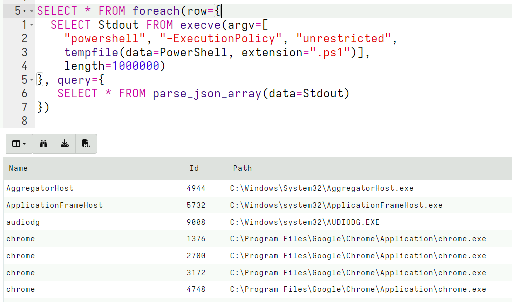
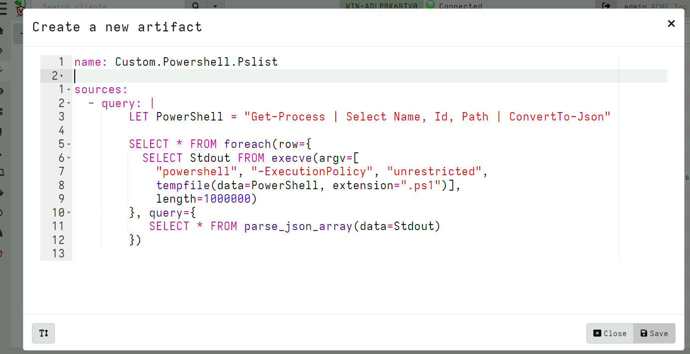

<!-- .slide: class="content " -->

## Extending VQL - Artifacts

* The most obvious tool for extending VQL is simply writing additional
  artifacts. We have seen this done extensively in previous modules
* Artifacts serve to encapsulate VQL queries:
    * Allows us to reuse a complex VQL query without worrying too much
      about the implementation.
    * Allows the implementation to evolve with time - perhaps offering
      additional functionality or better algorithms

* Ultimately we are limited with the basic capabilities of the VQL engine.

---

<!-- .slide: class="content small-font" -->

## Extending artifacts - PowerShell

* Powershell is a powerful systems automation language mainly used on
  Windows systems where is comes built in and almost always available.

* Many complex software products contain powershell modules around
  automation and system administration.

* It does not make sense for Velociraptor to directly support complex
  software packages like Office365, Azure etc.
    * But it is critical to be able to recover forensically relevant
      data from these package

* Therefore it makes sense to wrap powershell scripts in VQL artifacts.

---

<!-- .slide: class="content " -->

## Exercise: PowerShell based pslist

* This is not a PowerShell course! So for this example we will use the
  following very simple snippet of PowerShell

```
Get-Process | Select Name, Id, Path
```


---

<!-- .slide: class="content " -->

## Exercise: PowerShell based pslist

* The `execve()` plugin takes a list of args and builds a correctly
escaped command line.
   * In many cases we dont need to encode the command line

```sql

LET PowerShell = "Get-Process | Select Name, Id, Path"

SELECT * FROM execve(argv=[
  "powershell", "-ExecutionPolicy", "unrestricted", "-c", PowerShell])
```

---

<!-- .slide: class="content " -->

## Alternative - encode scripts

```sql
LET PowerShell = "Get-Process | Select Name, Id, Path"

SELECT * FROM execve(argv=[
  "powershell", "-ExecutionPolicy", "unrestricted",
  "-encodedCommand",
  base64encode(string=utf16_encode(string=PowerShell))])
```

---

<!-- .slide: class="content " -->

## Alternative - tempfile scripts

```sql
LET PowerShell = "Get-Process | Select Name, Id, Path"

SELECT * FROM execve(argv=[
  "powershell", "-ExecutionPolicy", "unrestricted",
  tempfile(data=PowerShell, extension=".ps1")])
```

* Tempfiles will be automatically cleaned up at the end of the query

---

<!-- .slide: class="content " -->

## Dealing with output

* Using the execve() plugin we can see the output in Stdout
* It would be better to be able to deal with structured output though.
* We can use powershell's `ConvertTo-Json` to convert output to JSON
  and Velociraptor's `parse_json()` to obtain structured output.
* This allows VQL or operate on the result set as if it was natively
generated by a VQL plugin!

---

<!-- .slide: class="content small-font" -->

## Parsing JSON output

* PowerShell outputs a single JSON object which is an array all the
  rows.

* We need to parse it in one operation - so we need to buffer all the
  Stdout into memory (set length=1000000).

```sql
LET PowerShell = "Get-Process | Select Name, Id, Path | ConvertTo-Json"

SELECT * FROM foreach(row={
  SELECT Stdout FROM execve(argv=[
      "powershell", "-ExecutionPolicy", "unrestricted",
      tempfile(data=PowerShell, extension=".ps1")],
      length=1000000)
}, query={
  SELECT * FROM parse_json_array(data=Stdout)
})
```

---

<!-- .slide: class="full_screen_diagram" -->

## Encoding powershell into JSON



---

<!-- .slide: class="content small-font" -->

## Reusing powershell artifacts

* Since our powershell script is now encapsulated, we can use it
  inside other artifacts and plain VQL by calling
  `Artifact.Custom.Powershell.Pslist()`.
* Users of this artifact dont care what the PowerShell Script is or
  what it does - we have encapsulation!


