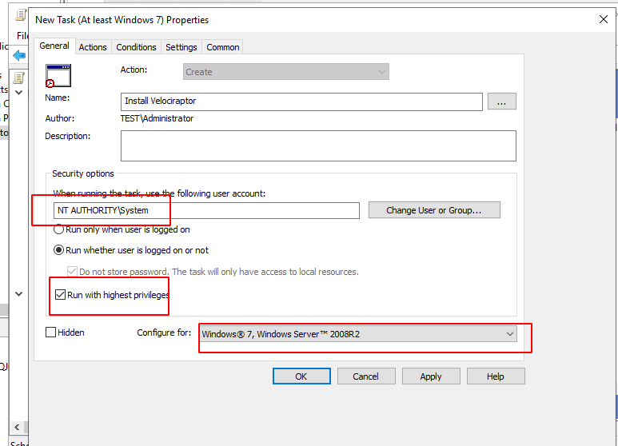
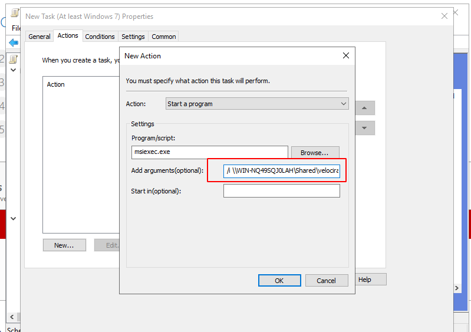
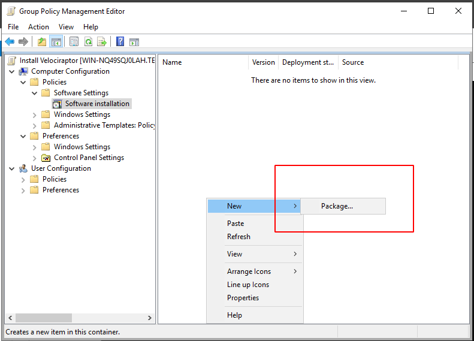

<!-- .slide: class="title" -->

# Configuring Clients

---

<!-- .slide: class="content" -->

## Deploying clients - Windows

* We typically distribute signed MSI packages which include the
  client’s config file inside them.  This makes it easier to deploy as
  there is only one package to install.

* Velociraptor can create the MSI to target the correct Org using the
  `Server.Utils.CreateMSI` artifact.

---

<!-- .slide: class="content small-font" -->
## Domain deployment

We can deploy the MSI to the entire domain using group policy.

Two Methods:
1. Via scheduled tasks.
2. Via assigned software.

---

<!-- .slide: class="full_screen_diagram small-font" -->

Create a share to serve the MSI from.

---

<!-- .slide: class="full_screen_diagram small-font" -->

Ensure everyone has read access from this share - and only administrators have write access!

---

<!-- .slide: class="full_screen_diagram small-font" -->

Use the group policy management tool create a new Group Policy Object in the domain (or OU)

---

<!-- .slide: class="full_screen_diagram small-font" -->
Edit the new GPO

---
<!-- .slide: class="full_screen_diagram small-font" -->

---

<!-- .slide: class="full_screen_diagram small-font" -->
Ensure the new scheduled task is run as system

---

<!-- .slide: class="full_screen_diagram small-font" -->

Using scheduled tasks you can run any binary - use this method to run
interactive collection if you do not have a dedicated Velociraptor
server

---

<!-- .slide: class="full_screen_diagram small-font" -->
Ensure the new scheduled task is run only once

---

<!-- .slide: class="full_screen_diagram small-font" -->

Method 2: install via assigned software packages in GPO. The main
advantage here is that it is possible to upgrade or uninstall
Velociraptor easily

---

<!-- .slide: class="full_screen_diagram small-font" -->

You will need to wait until group policy is updated on the endpoint or
until the next reboot. The endpoint must be on the AD LAN

