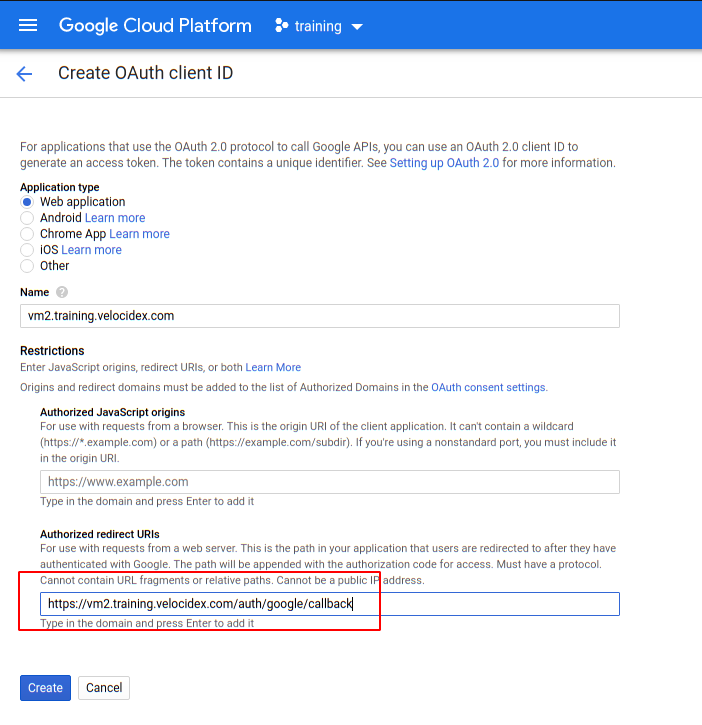

<!-- .slide: class="title" -->

# Deploying The Server

## Cloud deployment


---

<!-- .slide: class="content" -->
## Run Velociraptor on your machine

Download Velociraptor from GitHub (.msi or .exe)

```text
"C:\program files\Velociraptor\Velociraptor.exe" gui
```
---

<!-- .slide: class="full_screen_diagram small-font" -->

## Run Velociraptor on your machine

The "gui" command creates an instant temporary server/client with self
signed SSL and a hard coded admin/password.


---

<!-- .slide: class="content" -->
## Self Signed SSL mode

* Frontend served using TLS on port 8000 (connected to clients)
* GUI uses basic authentication with usernames/passwords.
* GUI Served over loopback port 8889 (127.0.0.1)
    * By default not exposed to the network
    * You can use SSH tunneling to forward the GUI

---

<!-- .slide: class="content" -->
## Steps to deploy Velociraptor

1. Provision a VM in the cloud
   * Configure DNS (static or dynamic)
   * Configure OAuth2 SSO
2. Generate configuration files
3. Build debian packages and install
4. Build MSI packages for Windows
5. Deploy via GPO/SCCM etc.

* The instructor will demonstrate step 1. See the workshop setup
  document for credentials.

---

<!-- .slide: class="full_screen_diagram" -->

### Setting Dynamic DNS with Google Domains


---

<!-- .slide: class="full_screen_diagram small-font" -->

### Configuring Google OAuth2 requires a new project and a consent screen

**NOTE**: Do not add an application logo or require more permissions -
Google will require OAuth verification which can take weeks!


---

<!-- .slide: class="full_screen_diagram small-font" -->

### Generate OAuth client credentials.

Note you can have multiple credentials and multiple domains in the
same GCP project.


---

<!-- .slide: class="full_screen_diagram small-font" -->

* The redirect URL is the url which Google will use to call back to
  Velociraptor with the user’s successful login. Note the client id
  and secret - we will need to provide it in the server config.

It must be `https://<domain>/auth/google/callback`



---

<!-- .slide: class="full_screen_diagram small-font" -->


---

<!-- .slide: class="content small-font" -->
## Installing a new server

Use the password provided in the Workshop setup to log into the
server.

1. Fetch the latest Velociraptor Windows and Linux release binaries
2. Create a new configuration:

```
velociraptor config generate -i
```

3. Create a new server debian package

```
velociraptor --config server.config.yaml debian server
```

---

<!-- .slide: class="content small-font" -->
## Installing a new server

Push the debian package to the server using scp

```
scp velociraptor_server*.deb mike@123.45.67.89:/tmp/
```

Install package

```
sudo dpkg -i velociraptor_server*.deb
```


---

<!-- .slide: class="full_screen_diagram small-font" -->

Generate new configuration with the details in the Workshop setup document.


---

<!-- .slide: class="content small-font" -->

## Automating config generation

Some people want to automate the config generation step.
Velociraptor supports a JSON merge for non interactive configuration generation

```
velociraptor config generate --merge
    '{"autocert_domain": "domain.com", "autocert_cert_cache": "/foo/bar"}'
```


---


<!-- .slide: class="content small-font" -->
## Building a server deb package

```
./velociraptor-v0.7.0-windows.exe --config ~/server.config.yaml debian server --binary velociraptor-v0.7.0-windows.exe
```


---

<!-- .slide: class="content small-font" -->
## Deploying the server

* scp the deb file to the target server

```
sudo dpkg -i velociraptor_0.7.0_server.deb
```


---

<!-- .slide: class="content small-font" -->
## Deploying the server

When installing the deb package you might need to install dependencies
by using `apt-get install -f`


---

<!-- .slide: class="full_screen_diagram small-font" -->
### Deploying the server

* The service adds a new velociraptor user to run under.
* You can now access the Velociraptor server using your browser.


---

<!-- .slide: class="full_screen_diagram small-font" -->

### Deploying the server

The first time you navigate to the SSL URL the server will obtain a
certificate from Let's Encrypt. There will be a small pause as this
happens.


---

<!-- .slide: class="full_screen_diagram small-font" -->

### Deploying the server

You will be redirected to Google for authentication - Velociraptor
does not handle any credentials in this configuration. Google will
determine if the user authenticated properly (2 FA etc) and convey
simple info like the user’s email address and avatar.

<div style="text-align: center;">
   
</div>

---

<!-- .slide: class="full_screen_diagram" -->
## Your Velociraptor is ready to use!


