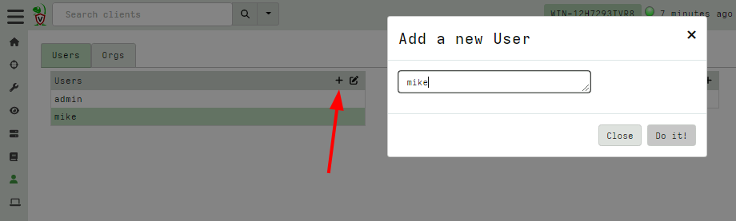
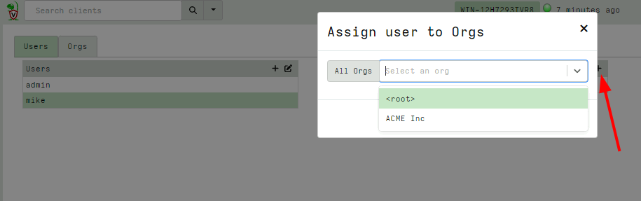
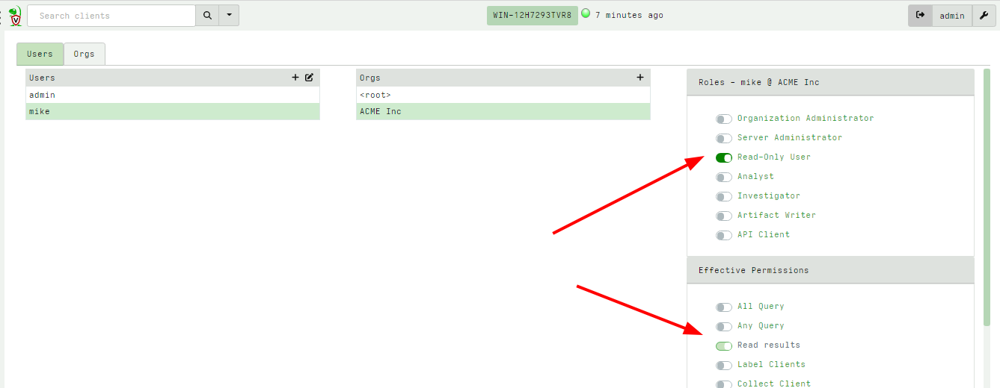
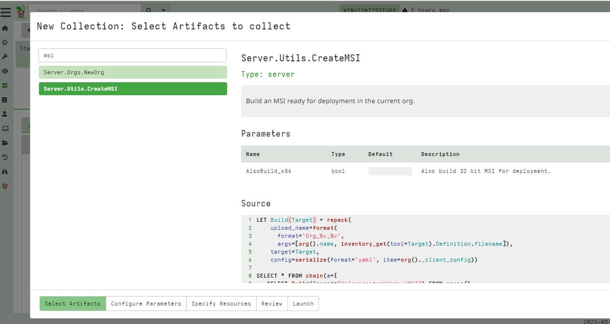
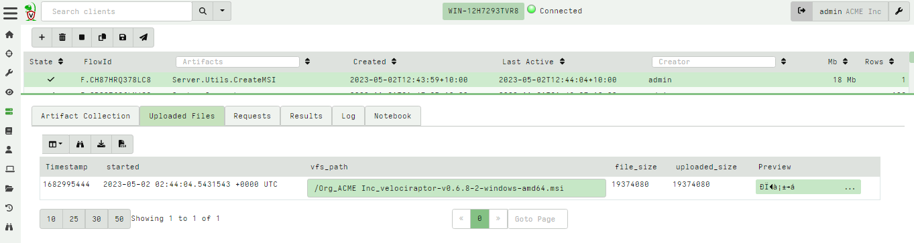
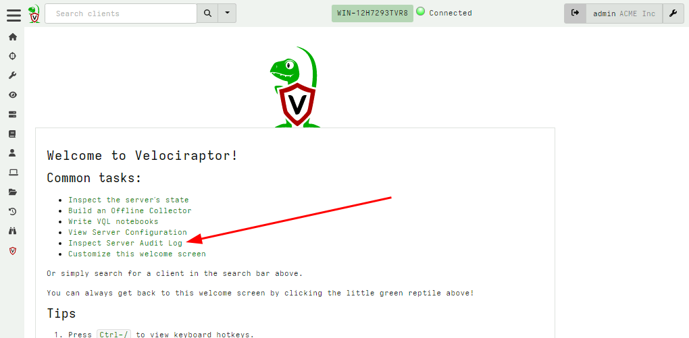
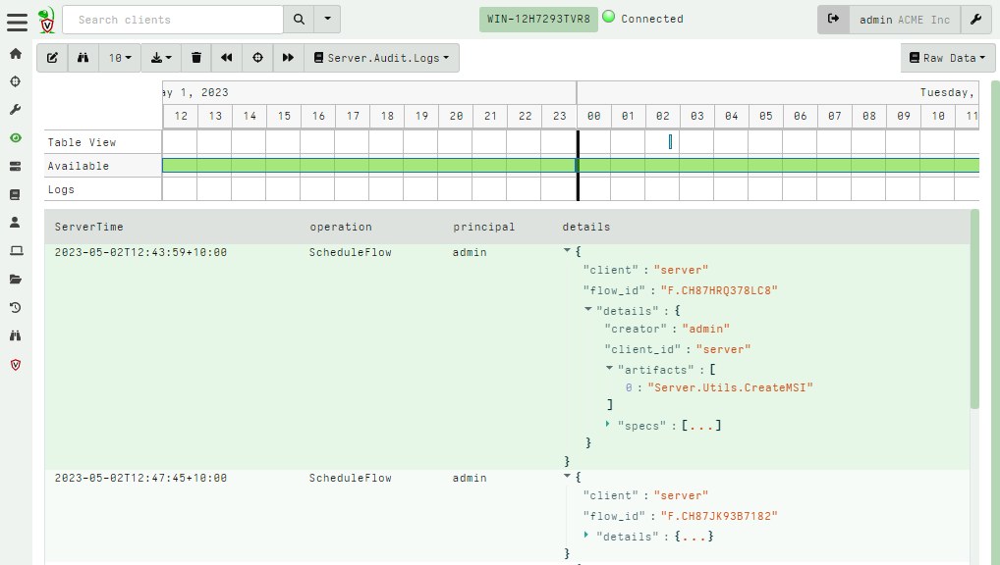

<!-- .slide: class="title" -->
# Multi-Tenancy and RBAC

## Securing Access

---

<!-- .slide: class="content small-font" -->
## Supporting Multiple Orgs

Velociraptor supports multiple orgs in a fully multi tenancy configuration.

* Clients are divided into `Orgs`
* Each `Org` is completely separated:
   * Files are stored in a different location
   * Users have different ACLs and rights in different orgs
   * Custom artifacts can be maintained in different Orgs
* Orgs can be created and destroyed easily at runtime
* All clients share the same infrastructure
* Different orgs' clients can not connect to other orgs

---

<!-- .slide: class="content small-font" -->
## Switching to different orgs

By default the `Velociraptor gui` command creates two orgs. Switch to
the second org sing the GUI's user preferences tab.

---

<!-- .slide: class="content small-font" -->
## Creating a new org

You can use the Server.Orgs.NewOrg artifact to create a new org

---

<!-- .slide: class="content small-font" -->

## Users and orgs

* A Velociraptor user is any entity that has permissions on the org
* Users may be able to log into the GUI or via the API (service accounts)
* Users need certain permissions to perform an action
* `Roles` are bundles of permissions - just a convenience! Extra
  permissions can also be given.

The default roles:

* `org_admin`
* `administrator`
* `reader`
* `api`

* `analyst`
* `investigator`
* `artifact_writer`

---

<!-- .slide: class="content small-font" -->

## Adding a new user

If using basic authentication you can change the user's password here
as well.

---

<!-- .slide: class="content small-font" -->

## Assign user to org

By default the initial role assigned is `reader`

---

<!-- .slide: class="content small-font" -->

## Adjust User permissions

User roles and permissions are only effective within an org. The same
user can have different roles in different orgs.

To delete a user, simply remove all their roles from an org.

---

<!-- .slide: class="full_screen_diagram" -->

### Preparing a deployment for the new org

* Clients are provisioned for their respective orgs.
   * You can prepare an MSI for deployment using the
     `Server.Utils.CreateMSI` artifact.

---

<!-- .slide: class="content small-font" -->

## Fetching the prepared MSI for deployment

The prepared MSI contains the relevant embedded config and is ready
for installation.

---

<!-- .slide: class="content small-font" -->

## Auditing user action

Velociraptor is a very powerful platform and requires strong auditing.

---

<!-- .slide: class="content small-font" -->

## Inspecting the audit timeline

It is also possible to forward audit events off system (remote syslog
or Open Search server)

