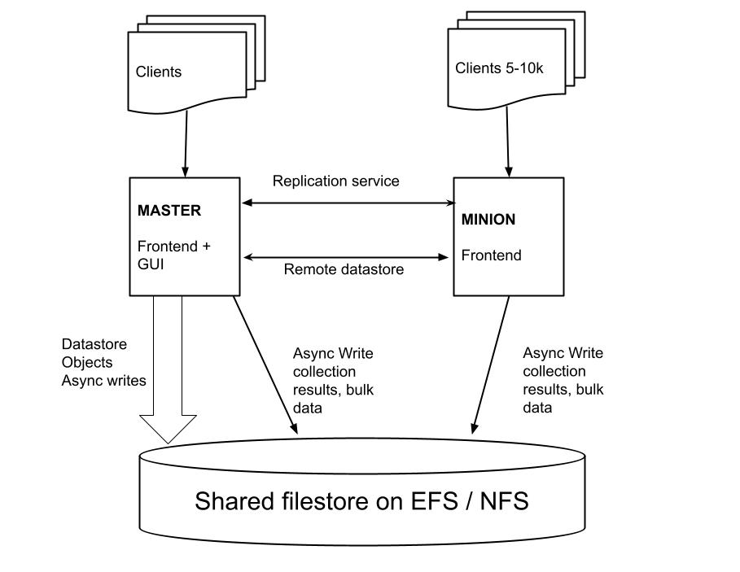

<!-- .slide: class="title" -->

# Additional deployment scenarios


---

<!-- .slide: class="content small-font" -->

## Using multiple OAuth providers

* It is possible to use multiple oauth providers at the same time.
* This is very useful when you need to provide access to people
  outside your org!
* The `multi` authenticator allows multiple OIDC providers to be
  chained in the same server: Just add them separated under the
  `sub_authenticators` key.

---

<!-- .slide: class="content" -->

## The multi Authenticator

```yaml
GUI:
  authenticator:
    type: multi
    sub_authenticators:
    - type: Google
      oauth_client_id: XYZ.apps.googleusercontent.com
      oauth_client_secret: XYZSecret
      default_session_expiry_min: 600
    - type: Github
      oauth_client_id: 1234
      oauth_client_secret: 1234secret
    - type: oidc
      oidc_issuer: https://dev-1234.okta.com/oauth2/default
      oidc_name: AcmeInc
      avatar: https://example.com/acme.png
      oauth_client_id: XYZ.apps.googleusercontent.com
      oauth_client_secret: XYZSecret
```

---

<!-- .slide: class="full_screen_diagram" -->

## MultiAuthenticator log in screen.

<div style="text-align: center;">
    
</div>

---

<!-- .slide: class="content" -->

## Exercise: Additional OAuth provider: Azure

* Add Azure as an alternate authentication provider!
* The instructor will illustrate the Azure process for obtaining credentials
* The instructor will provide the Azure credentials for your own VM.

---

<!-- .slide: class="content small-font" -->

## Client certificate based authentication.

* You do not need to use any authentication provider at all!
* It is possible to rely solely on client side certificates
* The process is similar to getting API certificates:

```sh
$ velociraptor config api_client --name Mike --role administrator --password --pkcs12 mike.pkcs12 mike.config.yaml
? Password: *******
Wrote PKCS12 file on mike.pkcs12.
Creating API client file on mike.config.yaml.
```


```yaml
GUI:
  authenticator:
    type: certs
```

---

<!-- .slide: class="content small-font" -->

## Import certificate into personal store (Manage User Certificates)


---

<!-- .slide: class="content" -->

## Multi-Frontend deployments

* We recommend single server deployment for networks < 20k endpoints.
* For larger networks, we recommend multi-frontend deployments.
* These require a shared network filesystem (e.g. NFS, EFS).
* Network filesystems tend to be very slow
   * Velociraptor will use many tricks to achieve reasonable
     performance on network filesystems!

---

<!-- .slide: class="full_screen_diagram" -->

### Multi frontend deployment overview

<div style="text-align: center;">
    

https://docs.velociraptor.app/docs/deployment/cloud/multifrontend/

</div>

---

<!-- .slide: class="content small-font" -->

## Exercise: Create a Master/Minion deployment

* Create a multi-frontend deployment running on the same host VM
* This allows the GUI to run on a separate process and allows unloaded
  post processing/notebook operations.
* For our example:
   * Configure the minion node to listen on port 8005 and
     the master can remain on port 8000
   * Start the master and minion frontends manually to see what is
     happening:

```sh
velociraptor -v --config server.config.yaml frontend --minion --config.frontend-bind-port 8005
velociraptor -v --config server.config.yaml frontend
```

---

<!-- .slide: class="content" -->

## Exercise: Customizing the dashboard

* When running multiple deployments or multiple orgs it is convenient
  to customize the dashboard.

* Customize the dash board to add your name to the main page. This
  helps identify your deployment.

---

<!-- .slide: class="content small-font" -->

## Server Lockdown Mode

* Velociraptor is an extremely powerful tool.
* A Velociraptor Server Admin account takeover can be very dangerous!
* But we still want to have it available so we can respond quickly.
* `Server Lockdown Mode` prevents Velociraptor from performing any
  destructive actions while in lockdown!

Add the following to the `server.config.yaml` and restart the server

```
lockdown: true
```


