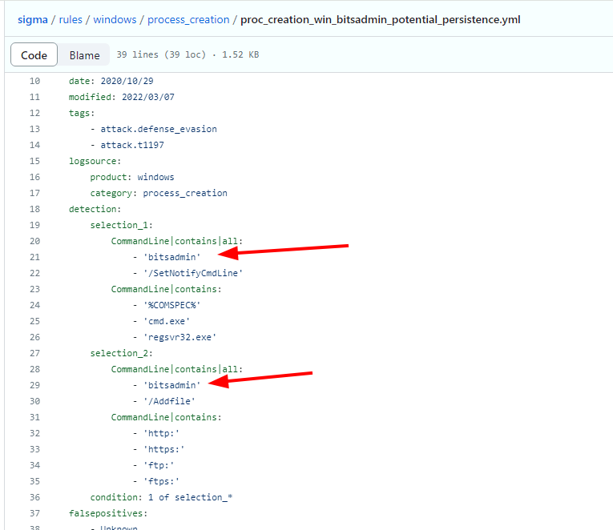
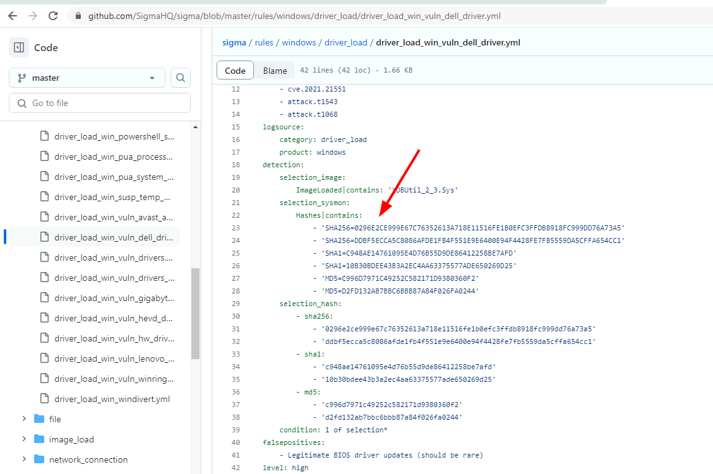
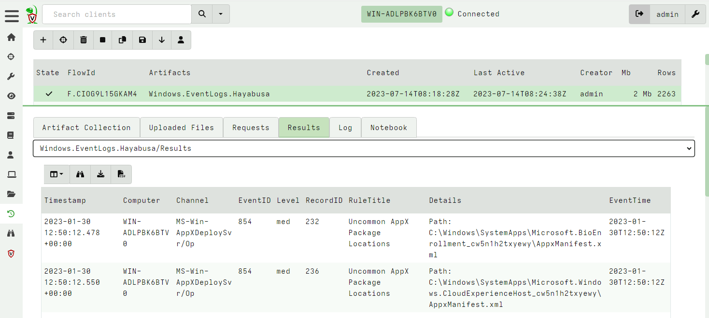
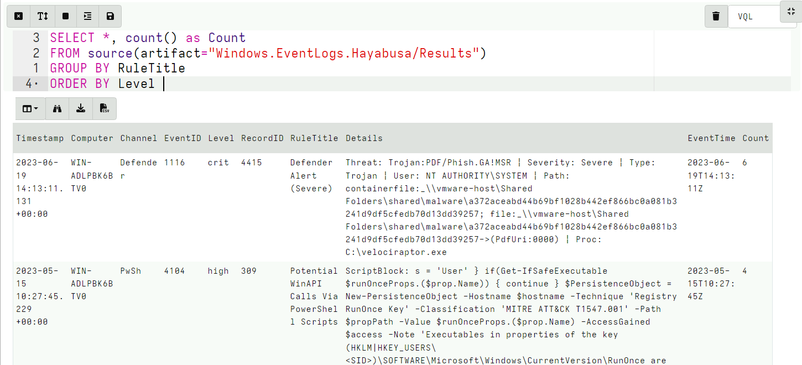

<!-- .slide: class="title" -->

# Detection engineering

---

<!-- .slide: class="content" -->

## Velociraptor vs. SIEM

* Velociraptor's unique approach:
  * Shift the queries to the endpoint
  * Have access to many sources of data
  * Relay back positive hits
  * Increase signal to noise

* This is very different from the traditional SIEM
  * Central store of all logs - data mining
  * Rely on event logs to be forwarded
  * Need to select which logs to forward - tradeoff
  * Query over the entire deployment

---

<!-- .slide: class="content" -->

## Event Log based detection

* Traditional SIEM only has access to forwarded event logs
* Event logs are usually too many to manually inspect
* Traditional Detection is all about rules to detect anomalous
  activity in log files.
   * Typically limited by the quality and type of the log source
   * Can be fragile and easily bypassed

---

<!-- .slide: class="content small-font" -->

## Sigma - a rule language for logs

[Generic Signature Format for SIEM Systems](https://github.com/SigmaHQ/sigma)

* There are many SIEM systems and each typically have their own query language (VQL, KQL, EQL etc).
* Sigma was designed to be a portable rule definition language that
  makes exchanging detection rules easier.
   * The Sigma compiler converts the rule to a target query language.
   * Doesnt really work in many case (not that portable)
   * Sigma is not really well defined leaving many fields to be
     interpreted by the compilers.

---

<!-- .slide: class="content" -->

## Some Sigma examples

https://github.com/SigmaHQ/sigma#examples

* Many rules detecting various signals
   * Some are trivial to bypasss
   * Some are stronger

---

<!-- .slide: class="content small-font" -->

### Some Sigma examples

* Command line based rules

---

<!-- .slide: class="content small-font" -->

### Some Sigma examples

* Hash based rules

---

<!-- .slide: class="content small-font" -->

## Sigma limitations

* Because Sigma is not a matching engine itself, it is hard to know
  what it does in more complicated rules.
   * Sigma notation can be too abstract and refer to data that is not
     available in practice.
* Generally try to stick to well used rules
   * Because the Sigma standard is not well defined there are many
     rules that dont work in the target query.
* For more complex rules, look at the compiled rules (e.g. in EQL) to
  see if they do what you want.
* Generally a high False Positive rate
* Sigma rules need to consider the available log sources and target
  platform.

---

<!-- .slide: class="content small-font" -->

## Sigma rule tips

* Write better Sigma rules:

    * Rather than matching large command lines, match smaller
      fragments. Command line order can vary
    * Include short flag and long flags
    * Use best available log source (e.g. Powershell script block
      logging over commandline matching).
    * Use OriginalFilename over ImageName when possible (robust
      against simple rename).
    * Use Imp hash over MD5 hashes - especially when signing is
      important.

---

<!-- .slide: class="content small-font" -->

## Using Sigma With Velociraptor

* Sigma is really designed to operate on forwarded event logs
* This means most rules are written to handle common log sources
* Usualy the Sigma compiler converts the rule to a target language.
* There are some tools that apply the sigma rules to raw Evtx files:

   * [Hayabusa](https://github.com/Yamato-Security/hayabusa) is a
      Windows event log fast forensics timeline generator and threat
      hunting tool. This is available via the
      `Windows.EventLogs.Hayabusa` artifact.

   * [Chainsaw](https://github.com/countercept/chainsaw) provides a
     powerful ‘first-response’ capability to quickly identify threats
     within Windows forensic artefacts such as Event Logs and MFTs.
     Available through the `Windows.EventLogs.Chainsaw` artifacts.

---

<!-- .slide: class="content small-font" -->

## Exercise: Hayabusa

* Collect the `Windows.EventLogs.Hayabusa` on your machine.
* What type of alerts do you see?

---

<!-- .slide: class="full_screen_diagram" -->

## Exercise: Hayabusa

---

<!-- .slide: class="full_screen_diagram" -->

## Exercise: Hayabusa

There are many false positives but a `group by` helps!

