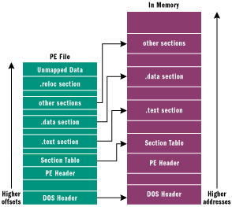
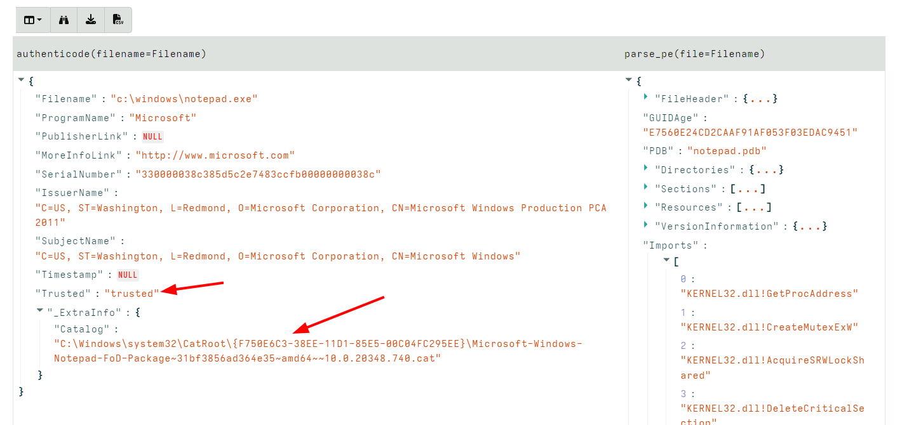
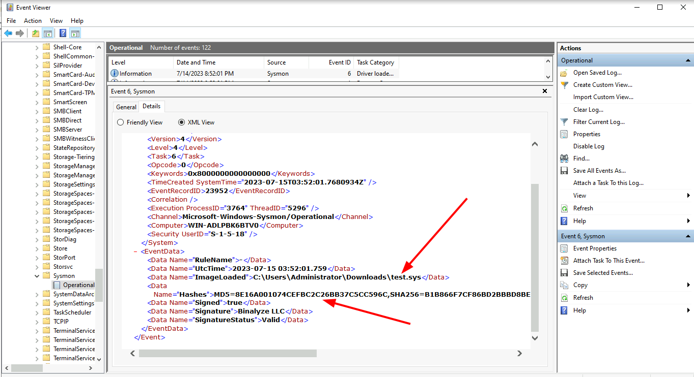
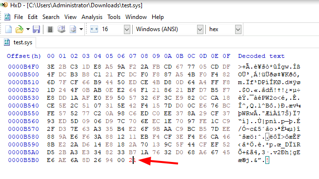
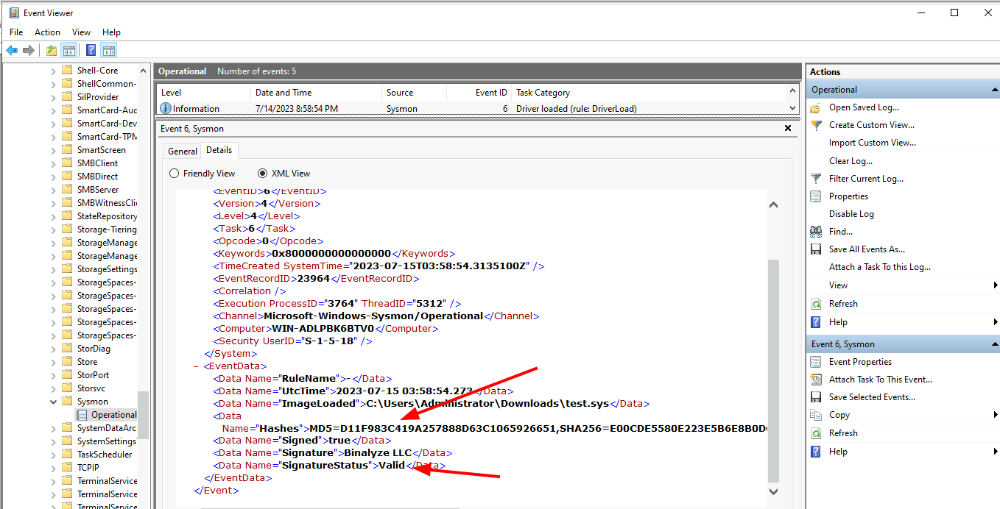
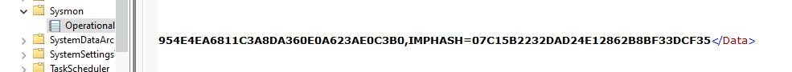
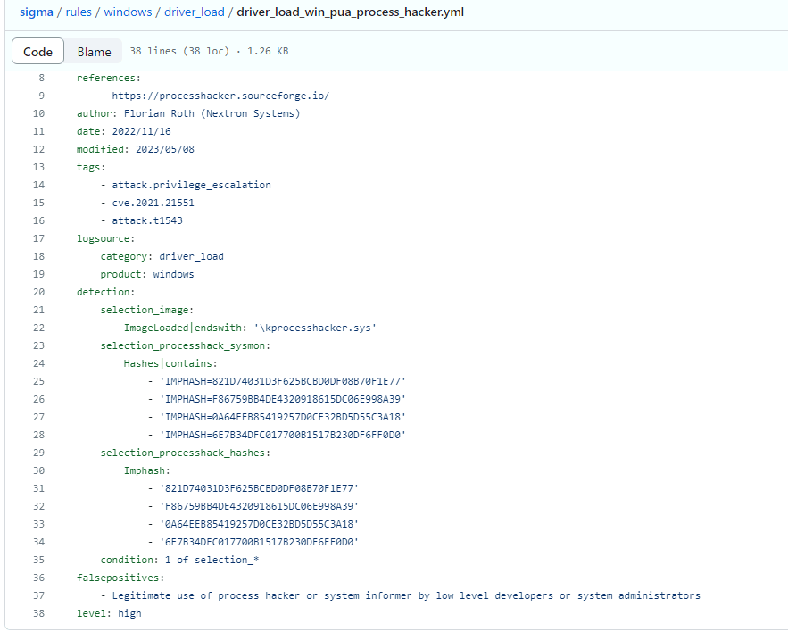

<!-- .slide: class="content" -->

## PE Files

* In Windows, executables are stored in a [Portable Executables
  (PE)](https://learn.microsoft.com/en-us/windows/win32/debug/pe-format)
  file format.
* PE files contain some interesting properties:
  - Divided into sections
    - Import Address Table (IAT)
    - Export Address Table (EAT)
    - Resources
    - VersionInformation
* PE Files can be signed using Authenticode
  - Some things like drivers require signatures
  - EDRs typically trust signed binaries more than unsigned.
  - Authenticode hash does not cover the whole file!

---

<!-- .slide: class="full_screen_diagram" -->

### PE File structure



[msdn-magazine](https://learn.microsoft.com/en-us/archive/msdn-magazine/2002/february/inside-windows-win32-portable-executable-file-format-in-detail)

---

<!-- .slide: class="content" -->

## Authenticode - signing PE files

* The [Authenticode
  standard](https://download.microsoft.com/download/9/c/5/9c5b2167-8017-4bae-9fde-d599bac8184a/authenticode_pe.docx)
  describes how a PE file can be signed.
* An `Authenticode Hash` is constructed over a subset of the file
  covering the critical parts required for execution.
  * Not all the file is covered in the authenticode hash!
  * This means that it is trivial to change the file hash and keep the
    authenticode hash the same!

---

<!-- .slide: class="content" -->

## Authenticode - signing via Catalogue

* In Windows there is another mechanism for signing many files:
`Catalogue signing`

* This works by signing a list of trusted hashes and storing in
  `C:\Windows\system32\CatRoot\{F750E6C3–38EE-11D1–85E5–00C04FC295EE}`

* Details here [Verifying executables on Windows](https://docs.velociraptor.app/blog/2021/2021-06-09-verifying-executables-on-windows-1b3518122d3c/)


---

<!-- .slide: class="content" -->

## Parsing PE Files

* In Velociraptor, PE files can be parsed from disk or memory.
* PE files are parsed using the `parse_pe()` function.
* Authenticode signature is verified using the `authenticode()` function

```sql
LET Filename = "c:/windows/notepad.exe"

SELECT authenticode(filename=Filename), parse_pe(file=Filename)
FROM scope()
```

---

<!-- .slide: class="full_screen_diagram" -->

## Parsing PE Files



---


<!-- .slide: class="content" -->

## Exercise: Manipulating Driver hashes

* Drivers need to be signed to be able to load into the system
* Many drivers are vulnerable so attackers can bring the driver with
  them to gain access to kernel.
* In this exercise we play with inserting kernel drivers
* Make sure sysmon is installed by collecting the
  `Windows.Sysinternals.SysmonInstall` artifact

---

<!-- .slide: class="content small-font" -->

## Exercise: Manipulating Driver hashes

* Download `winpmem` from https://github.com/Velocidex/WinPmem/releases
* Extract the driver from the program:
```
winpmem_mini_x64_rc2.exe -d test.sys
```

* Create a service for the driver and start it
```
sc.exe create testpmem binPath=C:\Users\Administrator\Downloads\test.sys type=kernel
sc.exe start testpmem
```

---

<!-- .slide: class="full_screen_diagram" -->

## Exercise: Manipulating Driver hashes



---

<!-- .slide: class="full_screen_diagram" -->

## Exercise: Manipulating Driver hashes

Modify the binary by changing bytes that are not covered by the
authenticode hash



---

<!-- .slide: class="full_screen_diagram" -->

## Exercise: Manipulating Driver hashes

Reload the driver and examine the Sysmon log



---

<!-- .slide: class="content" -->

## Hashes and PE files

* Hashes are considered very low quality indicators
* Not all created equal:
   * Full file hashes can be changed without affecting Authenticode
   * Imp hashes are more reliable in this case.
* Example of weaker rules:
   https://github.com/SigmaHQ/sigma/tree/master/rules/windows/driver_load

* Can be strengthened by using imp hashes instead.



---

<!-- .slide: class="content" -->

## Weak Hash based detection rule


---

<!-- .slide: class="content" -->

## Stronger detection rule


