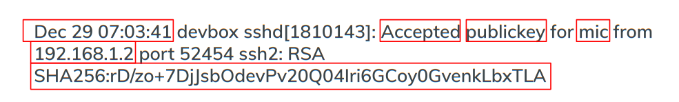
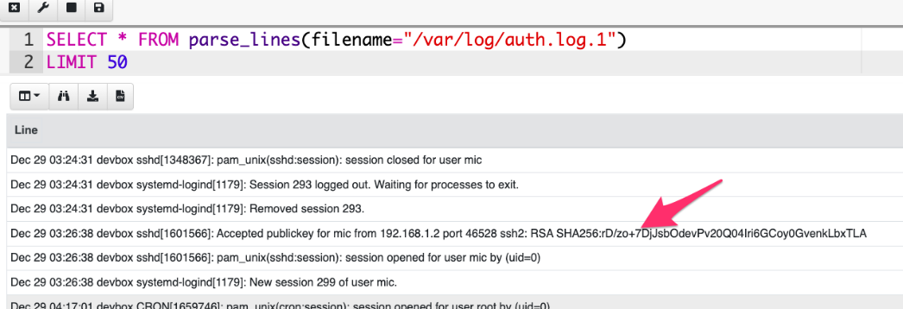
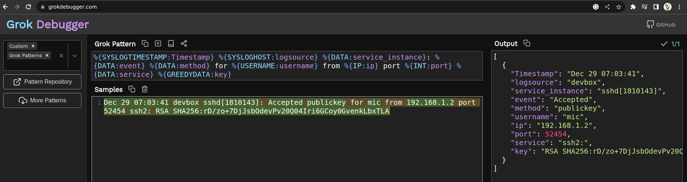
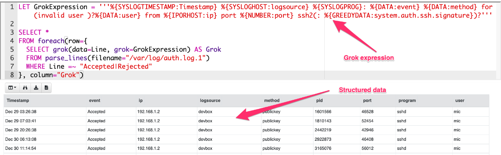

<!-- .slide: class="title" -->
# Syslog logs

## Linux/Unix line based event logs

---

<!-- .slide: class="content" -->

## Line based logging

* On Linux line based logging is very common.

* Logs typically are **unstructurd**
    * Each application emits logs in free form text.
    * Makes it very difficult to accurately extract data

Example - Use Grok to detect SSH login events.

* Common compromise sequence:
    * Attackers compromise one machine through a vulnerability, or password guessing
    * Due to unsecured ssh keys, they can laterally move to other machines in the network.

---

<!-- .slide: class="content" -->

## Parsing SSH login events

* Linux systems typically use syslog for logging
   * Line based unstructured logs
   * Difficult to query across systems.
   * events are stored in /var/log/auth.log

* Looks similar to



---

<!-- .slide: class="content" -->

## Grok for parsing syslogs

* Grok is a way of applying regular expressions to extract structured information from log files.
* Used by many log forwarding platforms such as Elastic for example:

```
%{SYSLOGTIMESTAMP:Timestamp} %{SYSLOGHOST:logsource}
%{SYSLOGPROG}: %{DATA:event} %{DATA:method} for (invalid user )?%{DATA:user}
from %{IPORHOST:ip} port %{NUMBER:port}
ssh2(: %{GREEDYDATA:system.auth.ssh.signature})?
```

---

<!-- .slide: class="content" -->

## Let's use VQL to parse ssh events

Read the first 50 lines from the auth log



---

<!-- .slide: class="content" -->

## Filter lines and apply Grok


* Grok expressions for common applications are well published.
* You can figure out expressions for new log sources using online tools.

https://grokdebugger.com/




---

<!-- .slide: class="content" -->

## Parsing log lines with Grok

* Applying the grok expression will match a dict
* Use foreach to expand the dict into columns


