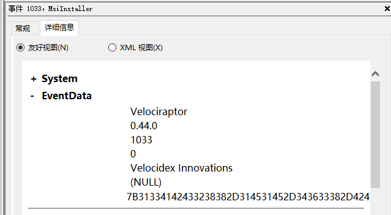

<!-- .slide: class="title" -->
# Windows Event Logs

---

<!-- .slide: class="content" -->

## Windows Event Logs

* Stored in files with extension of `*.evtx` typically in
  `C:\Windows\System32\WinEVT\Logs\*.evtx`

* File format features:
    * `Rollover` - File is divided into chunks and new chunks can
      overwrite older chunks
    * Binary XML format provides compression
    * Structured records with strong types

---

<!-- .slide: class="content" -->

## Parsing EVTX

* The event message is actually written in XML but Velociraptor
  convert it into a JSON object to make it easier to filter specific
  fields.

* Event significant fields
    * `Provider`, `Channel`, `Computer` - this represents the source
      of the message
    * `Event ID` - An index into the message table identifying the
      type of this event
    * `EventRecordID` - The ID of this message within the evtx file.
    * `UserData` - An application specific blob of structured data

---

<!-- .slide: class="content" -->

## Event Messages - Where are they?

* Windows Event Logs architecture does NOT store the event message in the evtx file!
    * This allows for event message internationalization
    * Saves some small amount of space in the evtx files themselves
    * But mostly makes it difficult to analyze offline
    * Grabbing all the EVTX files off the system may result in loss of
      event messages!

---

<!-- .slide: class="full_screen_diagram" -->

### Internationalization of the log message




---

<!-- .slide: class="full_screen_diagram" -->

### The Event description is missing from the evtx file.

The event description message contains vital context about what the
event actually means.  Without the message we would need to search for
the event id.


---

<!-- .slide: class="content" -->

## Event message search

<div class="container">
<div class="col">

If you copied the event log files off the system and do not have
access to the messages, you will need to figure out what does the
event id mean.

Some common event ids are documented publicly.

</div>
<div class="col">


</div>

---

<!-- .slide: class="content" -->

## Deriving event messages

* Using the `provider`, `channel` and `computer name` lookup the registry key

`HKLM\SYSTEM\CurrentControlSet\`
`Services\EventLog\<channel>\<provider>`

* Read the value `EventMessageFile`.

* This will point at a DLL path, open the resource section of this dll
  for a Message Table resource.
* This will produce a formatted string.
* Interpolate the UserData section into the string.

---

<!-- .slide: class="content" -->

## Deriving event messages

* Open the DLL
* Locate the resource section in the PE file of this dll, searching
  for a Message Table resource.

* A `MESSAGE_TABLE` resource is a list of strings - the Event ID is an
  index into this table.

* This will produce a string with expansion directives like `%1`, `%2`
  etc. Interpolate the UserData section into the string.

---

<!-- .slide: class="full_screen_diagram" -->

### Resolving a message from an event


---

<!-- .slide: class="content small-font" -->

## Resolving Messages

* Velociraptor can automatically follow this process when parsing
  event logs using the `parse_evtx()` plugin.  Notice the `UserData` is
  expanded into the messages.


---

<!-- .slide: class="content" -->

## What could go wrong?

* If you just collect the EVTX files from one system to another you
  will lose access to message tables, because the messages are in DLL
  files scattered across the entire system.

* If an application is uninstalled, its message DLLs will be removed
  and earlier events are not able to be displayed any more.

**It is always better to parse the event logs on the host than to transfer evtx files.**

---

<!-- .slide: class="content" -->

## Event Message databases

* The https://github.com/Velocidex/evtx-data repository contains
  sqlite databases of many known message tables collected from
  different systems.

* The [dumpevtx](https://github.com/Velocidex/evtx) tool can resolve
  messages from these databases and the sqlite databases.

---

<!-- .slide: class="content" -->

## References

* https://www.appliedincidentresponse.com/windows-event-log-analyst-reference/

* https://docs.microsoft.com/en-us/windows/security/threat-protection/auditing/audit-logon

---

<!-- .slide: class="content" -->

## Disabling event logs

* Event logs can be easily disabled!


---

<!-- .slide: class="content" -->

## Exercise - How can we detect this?

1. Use `ProcMon` to understand what registry keys are changing

2. Write a VQL artifact to detect if a log is enabled or disabled.

---

<!-- .slide: class="content" -->

## Solution: What is the setting?


---

<!-- .slide: class="content" -->

## Exercise: Detect disabled logs

* Write an artifact that reports the state of each log channel (enabled/disabled)

* Use the `Microsoft-Windows-Bits-Client/Operational` channel as an example

---

<!-- .slide: class="content" -->

## Solution

<div class="solution solution-closed">

```sql
LET Key = "HKLM/Software/Microsoft/Windows/CurrentVersion/Winevt/Channels/*"

SELECT *, Key.OSPath.Basename AS ChannelName
FROM read_reg_key(globs=Key)
WHERE ChannelName =~ "bits"
```


</div>

---

<!-- .slide: class="content small-font" -->

## Exercise: Convert to an artifact

Write an artifact that can be used to hunt for enabled or disabled event logs.
