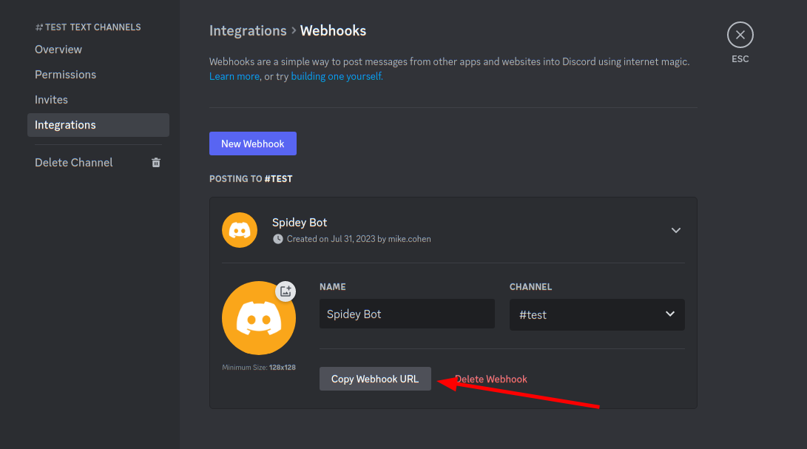
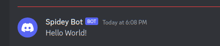

<!-- .slide: class="title" -->

# Alerting and Escalation

---

<!-- .slide: class="content" -->

## Integration with Slack/Discord

* Many systems allow interactions through a REST API
* This is basically HTTP requests.
* We can use the `http_client()` plugin to make web request.
* https://support.discord.com/hc/en-us/articles/228383668-Intro-to-Webhooks

---

<!-- .slide: class="content" -->

## Integration with Slack/Discord




---

<!-- .slide: class="content small-font" -->

## Sending a message to a discord channel

* Use `http_client()` to POST the request to the webhook.
* More information https://birdie0.github.io/discord-webhooks-guide/structure/content.html

```sql
LET DiscordURL = "https://discord.com/api/webhooks/1135479909406490736/8272quOa1IEh4GV1IJDbvEmGbXKQQl7PUnvb92ZJDqwUFGa8X9LF0gh_0DSKl8t1p7VC"

SELECT *
FROM http_client(
  url=DiscordURL,
  method="POST",
  headers=dict(`Content-Type`="application/json"),
  data=serialize(
    format="json",
    item=dict(content="Hello World!")))
```

---

<!-- .slide: class="content" -->

## Sending a message to a discord channel



---

<!-- .slide: class="content" -->

## Exercise: Alert discord when a new hunt is created

* Write an artifact to forward alerts to a discord channel when a hunt is created.
* Your instructor will create and share a webhook URL

* What other events can your webhook trigger on?

---

<!-- .slide: class="content" -->

## The Alerting framework

* Velociraptor server event artifacts can trigger on any event from
  the client or the server.

  * But we have to name the actual event - this makes it hard to watch
    many events at the same time.
  * When watching a client event we need to name the client id - this
    does not scale to many clients.

---

<!-- .slide: class="content" -->
## The Alerting framework

* Velociraptor has a generic event queue `Server.Internal.Alerts`
  * When any artifact uses the `alert()` VQL function, the message is
    routed to this queue
  * The `alert()` function accepts a structured message
  * Alerts are supposed to be low volume pointers that more review is
    needed. There are deduplicated heavily.
  * Alerting can be done on the client in any artifact - including
    normal collections.

---

<!-- .slide: class="content" -->

## Exercise: Forwarding alerts to Discord

* Write an artifact to forward alerts to a discord channel.
* Add alerting capabilities to other artifacts:
  * Alert when a process listing is found with the `psexec` process
  * Create an alert with a link back to the Velociraptor console to view the collection.


---

<!-- .slide: class="content" -->

## Other integrations

* Using `http_client()` allows VQL to interface with many external
  REST based system:

  * Slack integration [Server.Slack.Clients.Enrolled](https://docs.velociraptor.app/exchange/artifacts/pages/server.slack.clients.enrolled/)
  * Telegram [Server.Telegram.Clients.Enrolled](https://docs.velociraptor.app/exchange/artifacts/pages/server.telegram.clients.enrolled/)
  * IRIS [Server.Alerts.Monitor.IRIS](https://docs.velociraptor.app/exchange/artifacts/pages/server.alerts.monitor.iris/)
  * VirusTotal [Server.Enrichment.Virustotal.FileScan](https://docs.velociraptor.app/exchange/artifacts/pages/server.enrichment.virustotal.filescan/)

* If you have a lot of requests to make use `foreach()` with large
  number of workers.
