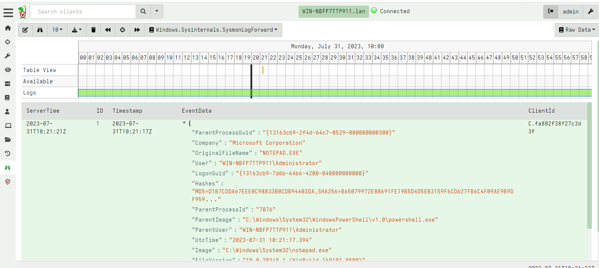

<!-- .slide: class="content" -->

## Example: Lateral Movement with WMI


* WMI may be used to [create processes remotely](https://www.blackhat.com/docs/us-15/materials/us-15-Graeber-Abusing-Windows-Management-Instrumentation-WMI-To-Build-A-Persistent%20Asynchronous-And-Fileless-Backdoor-wp.pdf):
```
wmic process call create "notepad.exe"
```

This works by invoking the `Create` method of the `Win32_Process` WMI
class.  This is very suspicious. Lets implement an Event Artifact to
detect this.

---

<!-- .slide: class="content" -->

## Lateral Movement: WMI Win32_Process.Create

* We can use WMI eventing to install a watcher on WMI calls
  themselves! The following WMI query will generate an event for each
  call of the `Create` method

```sql
SELECT * FROM
MSFT_WmiProvider_ExecMethodAsyncEvent_Pre
WHERE ObjectPath="Win32_Process" AND MethodName="Create"
```

---

<!-- .slide: class="content" -->

## Lateral Movement: WMI Win32_Process.Create

* The full VQL query

```sql
SELECT Parse from wmi_events(
  query='''SELECT * FROM MSFT_WmiProvider_ExecMethodAsyncEvent_Pre
           WHERE ObjectPath="Win32_Process" AND MethodName="Create"''',
  namespace='ROOT/CIMV2', wait=50000000)
```

---

<!-- .slide: class="content small-font" -->

## Exercise: Watch for event logs being cleared

* We can use WMI eventing to alert when certain event logs are emitted.
* For this exercise alert when a user clears an event log.

```
Select * From __InstanceCreationEvent Where
 TargetInstance ISA 'Win32_NTLogEvent' AND
 targetInstance.EventCode=XXXX
```

---

<!-- .slide: class="content" -->

## Sysmon support

* Sysmon is a great tool providing visibility into on host telemetry.

* In Velociraptor this is available through the artifact
  `Windows.Sysinternals.SysmonLogForward`

* It is a simple artifact that is used to just install sysmon and
  forward events.

---

<!-- .slide: class="content" -->

## Enable sysmon


