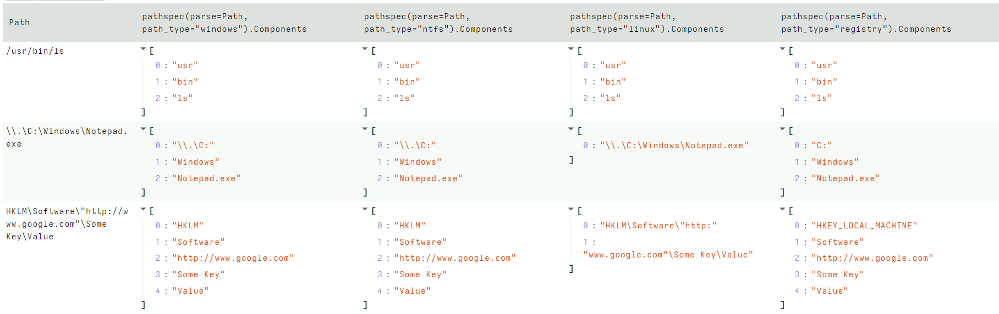

<!-- .slide: class="title" -->

# Filesystem Accessors

## Accessing data in many ways.

---

<!-- .slide: class="content small-font" -->

## What is an accessor?

* Velociraptor offers many plugins that operate on file data.
* Sometimes file data is available in many different contexts.
* An `accessor` is a driver that presents data in the shape of a
  filesystem:
  * Hierarchical data can be searched using the `glob()` plugin.
  * Data can be opened using a filename just like a file.
  * The actual implementation of how to read the data is varied.
  * Accessors deal with `OSPath` objects.

---

<!-- .slide: class="content small-font" -->

## The OSPath object

* Consists of the following data points:
   * `Components`: Directories are represented as a series of
     components.
   * `Path`: The stringified version of the components above (using path separator etc).
   * `Type`: The type of the OSPath controls how to serialize and
     parse the Components into a string (e.g. path separator).
   * `DelegateAccessor`: Some accessors work on the output from other accessors.
   * `DelegatePath`: The Path that will be passed to the `DelegateAccessor`.

* Have convenience methods and behaviors:
   * Indexing or slicing the `OSPath` gets the indexed `Component`
   * Has `Base` and `Dir` methods
   * Addition with a string overloaded.

---

<!-- .slide: class="content small-font" -->
## Parsing a string into an OSPath

* Paths are strings that are interpreted by the `accessor` to
  reference a file or directory.
   * Accessors are free to interpret the string in whatever way they
     wish.

* Accessors consume a `OSPath` object and return `OSPath` objects.
* Within the query all paths are represented by `OSPath` objects.
* On the way in (via plugin args) or out (via JSON encoding) the
  `OSPath` objects are converted to strings.
* Use the `pathspec()` function to control parsing of strings more
  carefully.

---

<!-- .slide: class="content small-font" -->

## Exercise: Parsing paths

In a VQL notebook parse the following paths using the `pathspec()`
plugin:

* `/usr/bin/ls`
* `\\.\C:\Windows\Notepad.exe`
* `HKLM\Software\"http://www.google.com"\Some Key\Value`

---

<!-- .slide: class="content " -->

## Exercise: Parsing paths

```sql
LET X = '''Path
/usr/bin/ls
\\.\C:\Windows\Notepad.exe
HKLM\Software\"http://www.google.com"\Some Key\Value
'''

SELECT pathspec(parse=Path, path_type="windows").Components,
       pathspec(parse=Path, path_type="ntfs").Components,
       pathspec(parse=Path, path_type="linux").Components,
       pathspec(parse=Path, path_type="registry").Components
FROM parse_csv(accessor="data", filename=X)
```

---

<!-- .slide: class="full_screen_diagram" -->

### Parsing paths



---

<!-- .slide: class="content small-font" -->

## Life of a Path

```
SELECT * FROM glob(globs="*", root='''\\.\C:\Windows''', accessor="ntfs")
```

1. The Glob plugin accepts a `pathspec` for the root parameter.
2. It is given a string `\\.\C:\Windows`.
3. `glob()` will now attempt to convert the string to an `OSPath`
   object. This depends on the accessor to interpret the data.
4. The `ntfs` accessor interprets the string into a list of path
   components: `\\.\C:`, `Windows`
5. The plugin will now list all the files in the directory using the
   `ntfs` accessor. For each file, we get an OSPath object.

---

<!-- .slide: class="content small-font" -->

## Exercise: OSPath operations


<!-- .slide: class="content" -->

## Basic accessors: file, auto

* We already encountered the `file` and `auto` accessors previously.
* Provide access to files.
* There are a number of different flavors:
    * A Windows path starts with a drive letter, or a device name, and
      uses `\` (preferred) or `/` for path separator.
    * Linux paths are rooted at `/`
