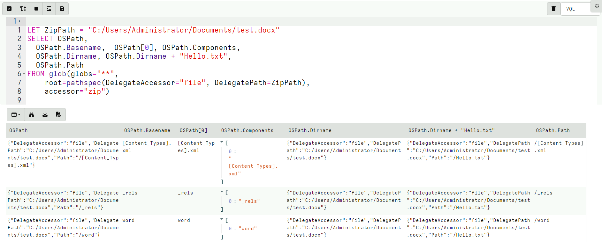

<!-- .slide: class="title" -->

# More about Accessors

## Accessing data in many ways.

---

<!-- .slide: class="content small-font" -->

## What is an accessor?

* Velociraptor offers many plugins that operate on file data.
* Sometimes file data is available in many different contexts.
* An `accessor` is a driver that presents data in the shape of a
  filesystem:
  * Hierarchical data can be searched using the `glob()` plugin.
  * Data can be opened using a filename just like a file.
  * The actual implementation of how to read the data is varied.
  * Accessors deal with `OSPath` objects.

---

<!-- .slide: class="content small-font" -->

## The OSPath object

* Consists of the following data points:
   * `Components`: Directories are represented as a series of
     components.
   * `Path`: The stringified version of the components above (using path separator etc).
   * `Type`: The type of the OSPath controls how to serialize and
     parse the Components into a string (e.g. path separator).
   * `DelegateAccessor`: Some accessors work on the output from other accessors.
   * `DelegatePath`: The Path that will be passed to the `DelegateAccessor`.

* Have convenience methods and behaviors:
   * Indexing or slicing the `OSPath` gets the indexed `Component`
   * Has `Base` and `Dir` methods
   * Addition with a string overloaded.

---

<!-- .slide: class="content small-font" -->
## Parsing a string into an OSPath

* Paths are strings that are interpreted by the `accessor` to
  reference a file or directory.
   * Accessors are free to interpret the string in whatever way they
     wish.

* Accessors consume a `OSPath` object and return `OSPath` objects.
* Within the query all paths are represented by `OSPath` objects.
* On the way in (via plugin args) or out (via JSON encoding) the
  `OSPath` objects are converted to strings.
* Use the `pathspec()` function to control parsing of strings more
  carefully.

---

<!-- .slide: class="content small-font" -->

## Exercise: Parsing paths

In a VQL notebook parse the following paths using the `pathspec()`
plugin:

* `/usr/bin/ls`
* `\\.\C:\Windows\Notepad.exe`
* `HKLM\Software\"http://www.google.com"\Some Key\Value`

---

<!-- .slide: class="content " -->

## Exercise: Parsing paths

```sql
LET X = '''Path
/usr/bin/ls
\\.\C:\Windows\Notepad.exe
HKLM\Software\"http://www.google.com"\Some Key\Value
'''

SELECT pathspec(parse=Path, path_type="windows").Components,
       pathspec(parse=Path, path_type="ntfs").Components,
       pathspec(parse=Path, path_type="linux").Components,
       pathspec(parse=Path, path_type="registry").Components
FROM parse_csv(accessor="data", filename=X)
```

---

<!-- .slide: class="full_screen_diagram" -->

### Parsing paths


---

<!-- .slide: class="content small-font" -->

## Life of a Path

```
SELECT * FROM glob(globs="*", root='''\\.\C:\Windows''', accessor="ntfs")
```

1. The Glob plugin accepts a `pathspec` for the root parameter.
2. It is given a string `\\.\C:\Windows`.
3. `glob()` will now attempt to convert the string to an `OSPath`
   object. This depends on the accessor to interpret the data.
4. The `ntfs` accessor interprets the string into a list of path
   components: `\\.\C:`, `Windows`
5. The plugin will now list all the files in the directory using the
   `ntfs` accessor. For each file, we get an OSPath object.

---

<!-- .slide: class="content small-font" -->

## Exercise: OSPath operations

* The OSPath object can be used to manipulate paths
   * Useful methods: `Basename`, `Dirname`, `Components`
   * Adding components, indexing gets specific components.
   * Works for complex nested paths

```sql
LET ZipPath = "C:/Users/Administrator/Documents/test.docx"
SELECT OSPath,
  OSPath.Basename,  OSPath[0], OSPath.Components,
  OSPath.Dirname, OSPath.Dirname + "Hello.txt",
  OSPath.Path
FROM glob(globs="**",
    root=pathspec(DelegateAccessor="file", DelegatePath=ZipPath),
    accessor="zip")
```

---

<!-- .slide: class="full_screen_diagram" -->

### OSPath operations



---


<!-- .slide: class="content" -->

## Basic accessors: file, auto

* We already encountered the `file` and `auto` accessors previously.
* Provide access to files.
* There are a number of different flavors:
    * A Windows path starts with a drive letter, or a device name, and
      uses `\` (preferred) or `/` for path separator.
    * Linux paths are rooted at `/`

---

<!-- .slide: class="content" -->

## The data and scope accessors

* Velociraptor contains many plugins that read files via accessors
* Sometimes data is already available as a string.
* The `data` accessor allows VQL plugins to treat a string as a file.
   * The filename is taken as the content of the file.
* The `scope` accessor is similar
   * The filename is takes an the name of a scope variable that
     contains the data.
   * Useful for uploads as the original path is also sent

---

<!-- content optional -->
## The ZIP accessor

* Zip files are a common basis for many file formats
    * e.g. `docx`, `pptx`, `jar`, `odt`
* Velociraptor makes it easy to access using the `zip` accessor:
    * `Path`: Is the path within the zip file
    * `DelegateAccessor`: The zip accessor will use this to open the
      underlying file.
    * `DelegatePath`: The zip accessor will use this to open the
      underlying file.

---

<!-- content optional -->

## Exercise: Search a word document for a keyword

* Create a `docx` document using `wordpad`
* Apply the `glob()` plugin with the zip accessor to view all the files.
* Apply the `yara()` plugin to searh the content of the zip for a keyword.

---

<!-- content optional -->

## Solution: Search a word document for a keyword

<div class="solution solution-closed">

```sql
LET ZipPath = "C:/Users/Administrator/Documents/test.docx"
LET Rule = '''
rule X {
    strings: $a="secret"
    condition: any of them
}
'''
SELECT * FROM foreach(row={
    SELECT * FROM glob(globs="**",
        root=pathspec(DelegateAccessor="file", DelegatePath=ZipPath),
        accessor="zip")
}, query={
    SELECT * FROM yara(rules=Rule, files=OSPath, accessor="zip")
})
```

</div>

---

<!-- content optional -->

## Exercise: Identify vulnerable Java programs

* Java programs can be compiled into a `JAR` file.
   * This is basically a zip file bundling all dependencies.
* Because dependencies are embedded in the JAR file:
   * If a library is compromised the entire program is still compromised
   * It is hard to know exactly which version of each library exists

* Write a VQL Artifact to detect JAR files that contain a particular
  set of hashs.

---

<!-- content optional -->

## Exercise: Identify vulnerable Java programs

* Download the vulnerable JAR from:

https://github.com/tothi/log4shell-vulnerable-app/releases

* Download vulnerable hashes from:

https://gist.github.com/xanda/7ac663984f3560f0b39b18437362d924

---

<!-- content optional -->

## Solution: Identify vulnerable Java programs

<div class="solution solution-closed">

```
LET HashList = SELECT Content
FROM http_client(url="https://gist.github.com/xanda/7ac663984f3560f0b39b18437362d924/raw/79d765296634c0407db99763d0b2c7c318e30078/Vulnerable_JndiLookup_class_hashes.csv")

LET VulnHashes <=
  SELECT * FROM parse_csv(accessor="data", filename=HashList[0].Content)

LET VulnMD5 <= VulnHashes.md5sum
LET VulnMD5Regex <= join(array=VulnHashes.md5sum, sep="|")

SELECT * FROM foreach(row={
   SELECT OSPath AS JAR FROM glob(globs="C:/Users/Administrator/Downloads/*.jar")
}, query={
   SELECT JAR, OSPath.Path AS Member, Size, hash(accessor="zip", path=OSPath) AS Hash
   FROM glob(globs="**",
       root=pathspec(DelegatePath=JAR),
       accessor="zip")
})
WHERE Hash.MD5 =~ VulnMD5Regex  // OR Hash.MD5 IN VulnMD5
```

</div>

---

<!-- .slide: class="content small-font" -->

## Raw registry parsing

* In a previous exercise we looked for a key in the
  `HKEY_CURRENT_USER` hive.
* Any artifacts looking in `HKEY_USERS` using the Windows API are
  limited to the set of users currently logged in! We need to parse
  the raw hive to reliably recover all users.

* Each user’s setting is stored in:
      `C:\Users\<name>\ntuser.dat`

* It is a raw registry hive file format. We need to use `raw_reg`
  accessor.

The raw reg accessor uses a PathSpec to access the underlying file.

---

<!-- .slide: class="content small-font" -->

## Exercise: Repeat the Run/RunOnce example with raw registry.

<div class="solution solution-closed">


```
LET RunGlob = '''SOFTWARE\Microsoft\Windows\CurrentVersion\Run\*'''

SELECT * FROM foreach(row={
  SELECT OSPath FROM glob(globs="C:/Users/*/NTUser.dat")
}, query={
  SELECT Name, Mtime, Data.value AS Data
  FROM glob(globs=RunGlob, accessor="raw_reg",
            root=pathspec(DelegatePath=OSPath))
})
```

</div>

---

<!-- .slide: class="content" -->

## The process accessor: accessing process memory

* Velociraptor can read process memory using the `process` accessor
* Process memory is not contiguous - it is very sparse.
* Velociraptor handles the sparse nature automatically
   * The yara plugin automatically handles sparse regions
   * Upload plugin skips uploading unmapped memory

---

<!-- .slide: class="content" -->

## Exercise: Write an artifact that uploads process memory

* Search for a keyword hit and upload the entire process memory if
  there is a hit.

   * Option: Uses `procdump()` to get a Windows debugger compatible
     crashdump

   * Option: Use `upload()` to get a Velociraptor sparse file.

---

<!-- .slide: class="content" -->

## Exercise: Write an artifact that uploads process memory

* Using `proc_dump()`

<div class="solution solution-closed">


```
SELECT * FROM foreach(row={
  SELECT Pid, Name
  FROM pslist() WHERE Name =~ "wordpad"
}, query={
  SELECT upload(file=FullPath) AS Upload, Name, Pid
  FROM proc_dump(pid=Pid)
})
```

</div>

---

<!-- .slide: class="content" -->

## Exercise: Write an artifact that uploads process memory

* Using `upload()`

<div class="solution solution-closed">

```
SELECT Pid, Name,
upload(accessor="process", file=str(str=Pid)) AS Upload
FROM pslist() WHERE Name =~ "wordpad"
```

</div>

---

<!-- content optional -->

## The sparse accessor

* Velociraptor can handle sparse files correctly.
* The `sparse` accessor allows you to create a sparse overlay over other data
   * Velociraptor will skip sparse regions when scanning or uploading
   * Useful when we want to avoid reading certain data
   * e.g. Memory scanning or Carving

```
FileName = pathspec(
      DelegateAccessor="data", DelegatePath=MyData,
      Path=[dict(Offset=0,Length=5), dict(Offset=10,Length=5)])
```

---

<!-- content optional -->

## Exercise: Upload only first 10k of each file.

* Write an artifact that uploads only the first 10kb of each file.

<div class="solution solution-closed">

```
LET Globs = "C:/Users/*/Downloads/*"

SELECT OSPath, upload(accessor="sparse",
  file=pathspec(DelegatePath=OSPath,
                Path=[dict(offset=0, length=10000),]),
                name=OSPath) AS Upload
FROM glob(globs=Globs)
```
</div>

---

<!-- .slide: class="content" -->

## The smb accessor

* It is possible to access a remote SMB server using the `smb` accessor.

* The accessor requires credentials for accessing the remote server.

* Credentials are provided via a scope parameter

```sql
LET SMB_CREDENTIALS <= dict(`192.168.1.11`="admin:password")

-- Or build from artifact args
LET SMB_CREDENTIALS <= set(item=dict(), field=ServerName,
  value=format(format="%s:%s", args=[Username, Password]))

```

---

<!-- .slide: class="content small-font" -->

## Exercise: Configuring an SMB share

* Configure an SMB share on your server and place a file there.
* Write a VQL query that searches the SMB share.

* See https://docs.velociraptor.app/docs/offline_triage/remote_uploads/#smb-share

<div class="solution solution-closed">

```
LET SMB_CREDENTIALS <= dict(`192.168.1.112`="administrator:test!password")

SELECT *
FROM glob(globs="**", root="//192.168.1.112/uploads", accessor="smb")
WHERE OSPath =~ ".exe$"
```

</div>
