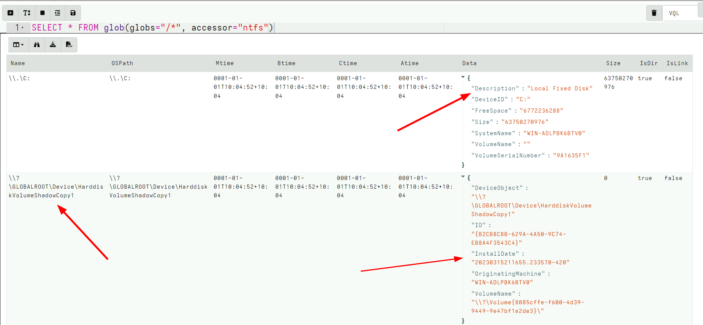
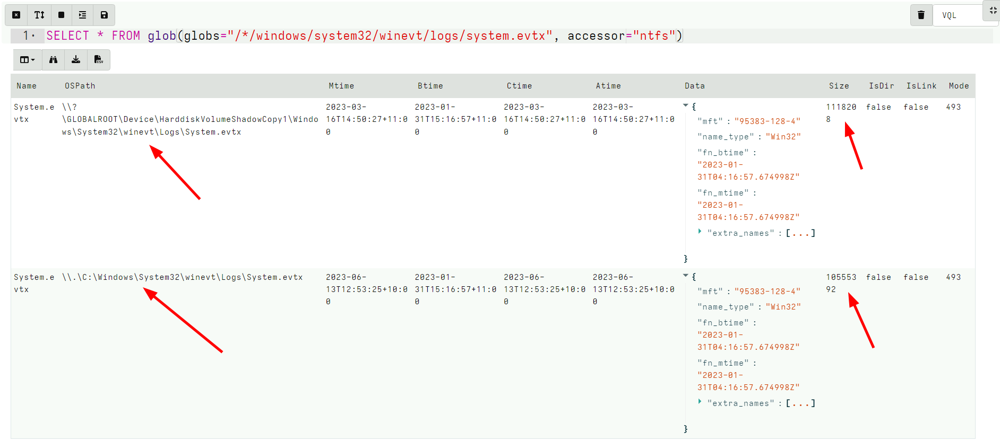
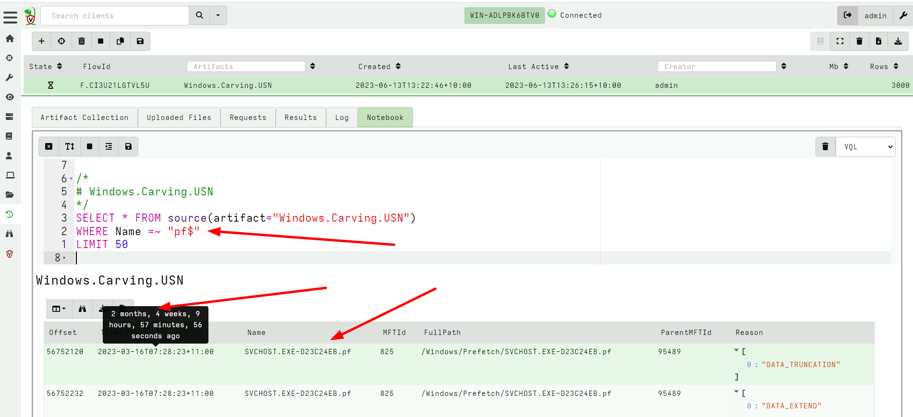

<!-- .slide: class="content small-font" -->

## Volume Shadow Copies

NTFS allows for a special copy on write snapshot feature called
`Volume Shadow Copy`.

Create a VSS copy on your own machine using WMI:

```sh
wmic shadowcopy call create Volume='C:\'
```

Ensure your system contains a volume shadow copy
```bash
vssadmin list shadows
```

Note:

On Windows server OS you can use:
```bash
vssadmin create shadow
```

---

<!-- .slide: class="content small-font" -->

## NTFS accessor and VSS

* When a VSS copy is created, it is accessible via a special
  device. Velociraptor allows the VSS copies to be enumerated by
  listing them at the top level of the filesystem.

* At the top level, the accessor provides metadata about each device
  in the “Data” column, including its creation time. This is
  essentially the same output as vssadmin list shadows

---

<!-- .slide: class="full_screen_diagram" -->

### Velociraptor shows VSS at the top level of the filesystem




---

<!-- .slide: class="content small-font" -->

## Exercise: Find all VSS copies of the event logs

* We can glob the VSS just as if they were a directory
* Makes it easy to fetch every version of a certain file (e.g. a log file).

---

<!-- .slide: class="full_screen_diagram small-font" -->

## Exercise: Find all VSS copies of the event logs

<div class="solution solution-closed">

```
SELECT *
FROM glob(globs="/*/windows/system32/winevt/logs/system.evtx", accessor="ntfs")
```



</div>

---

<!-- .slide: class="content" -->

## Carving The USN Journal

* The USN Journal is very useful to determine filesystem activities.
* However, it is normally limited to 30mb
* In practice the USN Journal rolls over quickly
* However, the journal is not overwritten!
* There is a large likelyhood that entries remain for a long time.

Lets carve them with `Windows.Carving.USN`

---

<!-- .slide: class="full_screen_diagram small-font" -->

### Carving USN Journal can recover events in the distant past




---

<!-- .slide: class="content small-font" -->

## Processing Live vs. Processing the $J file

* Tranditionally people collect the $J file and parse it offline.
* This approach is limited:

   * To reconstruct the full path we need to match up the MFT Id in
     the USN journal entry with the MFT information from the $MFT
     file.

   * Velociraptor automatically calculates the full path from the
     system using all available information. This is important for
     filtering and context.

   * Velociraptor can then open the relevant files when working on a
     live system.
