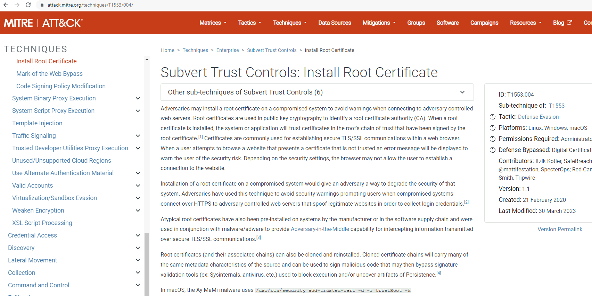

<!-- .slide: class="title" -->

# Parsing

## Processing and analysing evidence on the endpoint

---

<!-- .slide: class="content small-font" -->

## Parsing evidence on the endpoint

* By analyzing files directly on the endpoint we can extract relevant
  data immediately.

* Velociraptor supports sophisticated parsing strategies that allow
  VQL artifacts to extract maximum details directly on the endpoint.

   * Built in parsers (`parse_ntfs`, `parse_xml`, `parse_json`)
   * Text based parsers (`parse_string_with_regex`, `split`)
   * Binary parser

* By eliminating the need for post processing we can scale analysis
  across larger number of endpoints


---

<!-- .slide: class="content small-font" -->

## Built in parsers - SQLite

* SQLite is used in many contexts and many applications
* Velociraptor has a built in parser for SQLite that can be controlled
  via VQL.
   * If the SQLite file locked, Velociraptor with make a local copy!
* This allows Velociraptor to access many different types of evidence.

---

<!-- .slide: class="content small-font" -->

## Exercise: Parse the chrome Top Sites file

* Location is

```sh
C:\Users\*\AppData\Local\Google\Chrome\User Data\Default\Top Sites
```

* SQLite query to see the schema

```
SELECT * FROM sqlite_master
```

---

<!-- .slide: class="content small-font" -->

## Sqlite analysis


* Streamlined Artifact: https://github.com/Velocidex/SQLiteHunter

---

<!-- .slide: class="content " -->

## Complex RegEx parsing

* Sometimes log files are less structured and a regex based approach
  is not reliable enough.

* In this case think about how to split the data in a reliable way and
  apply regular expressions multiple times.

* Divide and Concur

---

<!-- .slide: class="content " -->

## Parsing with Regular Expressions

* Two main regex parsing tools:
   * `parse_records_with_regex()` splits text into larger "records"
   * `parse_string_with_regex()` extracts specific fields from each
     "record"

---

<!-- .slide: class="content " -->

## Exercise: MPLogs

* [Mind the MPLog: Leveraging Microsoft Protection Logging for Forensic Investigations](https://www.crowdstrike.com/blog/how-to-use-microsoft-protection-logging-for-forensic-investigations/)

* MPLog files are found in `C:\ProgramData\Microsoft\Windows Defender\Support`
* Events described in [This Reference](https://learn.microsoft.com/en-us/microsoft-365/security/defender-endpoint/troubleshoot-performance-issues?view=o365-worldwide)

Write a VQL Parser to parse these logs.

---

<!-- .slide: class="content small-font" -->

## Steps for solution

1. Locate data from disk and split into separate log lines (records).
    * Use `glob()`, `parse_lines()` and `utf16()`

2. Find a strategy to parse each record:
    * Will one pass Regex work?
    * What is the structure of the line?
    * Use `split()`

3. This about how to present the data:
    * Dict addition to combine several fields.

---

<!-- .slide: class="content small-font" -->

## Possible solution

* Not really perfect because log is not very consistent.

<div class="solution solution-closed">

```sql
LET LogGlob = '''C:\ProgramData\Microsoft\Windows Defender\Support\MPLog*.log'''

LET AllLines = SELECT * FROM foreach(row={
  SELECT utf16(string=read_file(filename=OSPath, length=10000000)) AS Data,
        OSPath
  FROM glob(globs=LogGlob)
}, query={
  SELECT Line, OSPath
  FROM parse_lines(filename=Data, accessor="data")
})

LET ParseData(Data) = to_dict(item={
  SELECT split(sep_string=":", string=_value)[0] AS _key,
         split(sep_string=":", string=_value)[1] AS _value
  FROM foreach(row=split(sep=", ", string=Data))
})

LET Lines = SELECT OSPath, Line,
   parse_string_with_regex(string=Line,
       regex="^(?P<Timestamp>[^ ]+) (?P<Data>.+)") AS P
FROM X
WHERE P.Timestamp

SELECT * FROM foreach(row={
   SELECT dict(Timestamp=P.Timestamp, _Line=Line, _OSPath=OSPath) +
          ParseData(Data=P.Data) AS Data
   FROM Lines
}, column="Data")
```

</div>

---

<!-- .slide: class="title" -->

# The Binary Parser

---

<!-- .slide: class="content " -->

## Parsing binary data

* A lot of data we want to parse is binary only
* Having a powerful binary parser built into VQL allows the VQL query
  to parse many more things!
* [VQL Binary parser](https://github.com/Velocidex/vtypes) is declerative.
   * Focus on **what** the data means not how to extract it.
   * Exact data layout is specified by a `Profile`

---

<!-- .slide: class="content small-font" -->

## What is binary data?

* Serialized representation of abstract data structures
* Declare the layout of the data and let the parser recover the data
  from the binary stream.

* Example: Parsing integers from binary stream.

```sql
LET Data = unhex(string="0102030405060708")
LET Parsed =  parse_binary(accessor="data", filename=Data, offset=4, struct="uint32")

SELECT Parsed, format(format="%#08x", args=Parsed)
FROM scope()
```

---

<!-- .slide: class="content small-font" -->

## Parsing a struct

* In practice most software arrange simple types into "records" or
  "structs". This lays the data in "fields"
* We can define a profile to interpret the binary data as fields.

```sql
LET Data = unhex(string="0102030405060708")
LET Profile = '''[
["Header", 12, [
  ["Field1", 0, "uint16"],
  ["Field2", 4, "uint32"]
]]]
'''

SELECT parse_binary(accessor="data", filename=Data, struct="Header", profile=Profile)
FROM scope()
```

---

<!-- .slide: class="content small-font" -->

## Parsing Structs


---

<!-- .slide: class="content small-font" -->

## Calculating fields

* In practice many fields, such as offsets or sizes are calculated
  based on the data.
  * Velociraptor supports these derived fields using `VQL Lambda`.
  * VQL Lambda is a function that receives the current struct as a
    parameter and returns a single value.
  * The calculated value will be used to parse the field.

```sql
LET Profile = '''[
["Header", 12, [
  ["OffsetOfField2", 1, "uint8"],
  ["Field2", "x=>x.OffsetOfField2 + 2", "uint32"]
]]]
'''
```

---

<!-- .slide: class="content small-font" -->

## Calculating fields


---

<!-- .slide: class="content " -->

## Unsecured SSH keys

<div class="container">
<div class="col">

A common mechanism of privilege escalation is compromise of SSH keys without password
* Can be immediately leveraged to gain access to other hosts
* e.g. AWS by default does not have password!

</div>

<div class="col">


</div>
</div>

---

<!-- .slide: class="content small-font" -->

<div class="container">
<div class="col">

## Traditional approach

1. Collect all ssh private key files in the environment.

2. Store them in a central locations.

3. Run specialized parser to determine if they keys are protected

</div>

<div class="col">

## Velociraptor approach

1. Write a (reusable) artifact to parse SSH private key files -
   determine if they are protected.

2. Hunt across the environment for unprotected files.

3. Remediate or focus on weak keys.

</div>
</div>


---

<!-- .slide: class="content small-font" -->

## How can I tell if a file is protected?
### Parsing SSH private key files.

<div class="container">
<div class="col">

* Private key files come in various formats and types
* Let's develop some VQL to parse it
* File format reference https://coolaj86.com/articles/the-openssh-private-key-format/

</div>
<div class="col">


</div>
</div>

---

<!-- .slide: class="content small-font" -->
## Exercise: Parse SSH Private keys

* Create some new ssh keys using `ssh-keygen`


---

<!-- .slide: class="content small-font" -->

## Step 1: read the file.

<div class="solution solution-closed">

```sql
LET Filename = '''C:\Users\Administrator/.ssh/id_rsa'''

SELECT read_file(filename=Filename) FROM scope()
```


</div>

---

<!-- .slide: class="content small-font" -->

## Step 2: Extract the base64 encoded part

* Using regular expressions we can isolate the base64 encoded data.
* Apply `base64decode()` to recover the binary data.
* What is the binary data though?
* Write a "Profile" and apply it to the binary data to extract fields.

<div class="solution solution-closed">

```sql
LET Filename = '''C:\Users\Administrator/.ssh/id_rsa'''

LET Decoded(Filename) = base64decode(
    string=parse_string_with_regex(
        string=read_file(filename=Filename),
        regex="(?sm)KEY-----(.+)-----END").g1)

SELECT Decoded(Filename=Filename) FROM scope()
```

</div>

---

<!-- .slide: class="content small-font" -->
## Step 3: Binary parser built in VQL

* Declare struct layout as a data driven "profile".

<div class="solution solution-closed">

```sql
LET SSHProfile = '''[
    ["Header", 0, [
      ["Magic", 0, "String", {
          "length": 100,
      }],
      ["cipher_length", 15, "uint32b"],
      ["cipher", 19, "String", {
          "length": "x=>x.cipher_length",
      }]
    ]]]
'''
```

</div>

* We can update the profile at any time without rebuilding the client.

---

<!-- .slide: class="full_screen_diagram small-font" -->

### Step 4: Parse the header and find if the key is encrypted.

<div class="solution solution-closed">

```sql
LET Filename = '''C:\Users\Administrator/.ssh/id_rsa'''
LET SSHProfile = '''[
        ["Header", 0, [
        ["Magic", 0, "String", {
            "length": 100,
        }],
        ["cipher_length", 15, "uint32b"],
        ["cipher", 19, "String", {
            "length": "x=>x.cipher_length",
        }]
      ]]]
      '''

LET Decoded(Filename) = base64decode(
    string=parse_string_with_regex(
      string=read_file(filename=Filename),
      regex="(?sm)KEY-----(.+)-----END").g1)

SELECT parse_binary(
         accessor="data",
         filename=Decoded(Filename=Filename),
         profile=SSHProfile,
         struct="Header") AS Parsed
FROM scope()
```

</div>

---

<!-- .slide: class="content small-font" -->
**Full SSH Private key parser**

*Uses binary parser, regular expression and file search*


---

<!-- .slide: class="content small-font" -->

## Exercise:  Parsing root certificates in the registry

* Subverting the certificate root store is an effective technique to
  intercept encryption. https://attack.mitre.org/techniques/T1553/004/



---

<!-- .slide: class="content small-font" -->

## Exercise:  Parsing root certificates in the registry

* Root certs are stored in the registry as a binary blob.
* Inspect the binary data
* Parse the binary data https://blog.nviso.eu/2019/08/28/extracting-certificates-from-the-windows-registry/

```sql
LET ColumnTypes = dict(Blob="base64hex")

LET Glob = '''HKEY_LOCAL_MACHINE\SOFTWARE\Microsoft\SystemCertificates\ROOT\Certificates\**\Blob'''

SELECT base64encode(string=Data.value) AS Blob
FROM glob(globs=Glob, accessor="registry")
```

---

<!-- .slide: class="content small-font" -->

## Solution

<div class="solution solution-closed">

```sql
LET ColumnTypes = dict(Blob="base64hex")
LET Glob = '''HKEY_LOCAL_MACHINE\SOFTWARE\Microsoft\SystemCertificates\ROOT\Certificates\**\Blob'''

LET profile = '''[
["Record", "x=>x.Length + 12", [
  ["Type", 0, "uint32"],
  ["Length", 8, "uint32"],
  ["Data", 12, "String", {
      length: "x=>x.Length",
      term: "",
  }],
  ["UnicodeString", 12, "String", {
      encoding: "utf16",
  }]
]],
["Records", 0, [
  ["Items", 0, "Array", {
      type: "Record",
      count: 20,
      sentinel: "x=>x.Length = 0",
  }]
]]
]'''

SELECT OSPath, Certificate FROM foreach(row={
  SELECT OSPath,
    base64encode(string=Data.value) AS Blob,
    parse_binary(accessor="data", filename=Data.value, profile=profile, struct="Records") AS Parsed
  FROM glob(globs=Glob, accessor="registry")
}, query={
  SELECT OSPath, parse_x509(data=Data)[0] AS Certificate
  FROM foreach(row=Parsed.Items)
  WHERE Type = 32
})
WHERE Certificate
```

</div>

---

<!-- .slide: class="content small-font" -->

## Parsing the trusted certificates from the registry


