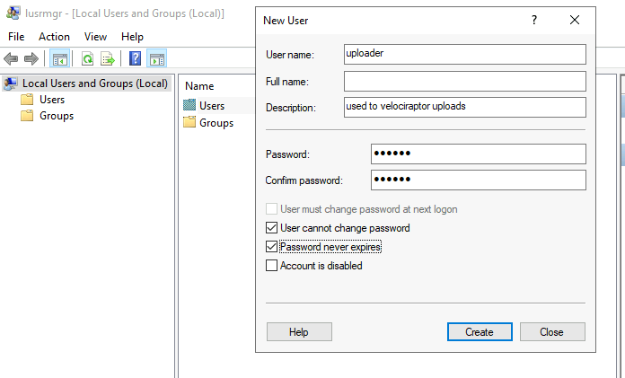
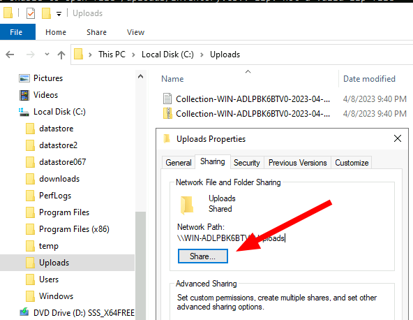
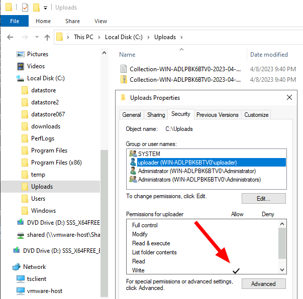
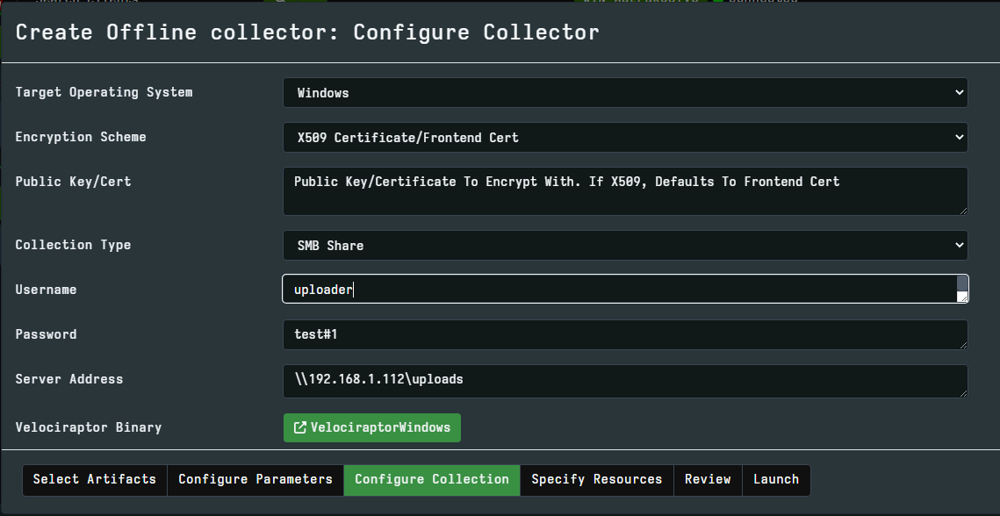

<!-- .slide: class="content" -->

## Uploading offline collections automatically

* Offline collections tend to be very large.
* This makes it difficult to transfer the collection back to the
  investigation team.
* Velociraptor offers a number of automated uploading mechanisms:
  1. SMB Upload (Windows Share)
  2. S3 or GCP uploads
  3. Azure storage service

---

<!-- .slide: class="content" -->

## Configure SMB upload

* Best used in an on-premises network
  * Can use any system on the network to receive the file.
* Need to secure the upload directory:
  * Create a special uploader account
  * Only allow uploader account access to write files.
  * Prevent uploader account from reading files.

---

<!-- .slide: class="content small-font" -->

## Step 1: Creating service account

* Need to create a new local user account to authenticate to the server.



---

<!-- .slide: class="content small-font" -->
## Step 2: Share directory to new user

* Create a directory on the server to accept uploads
* Share the directory



---

<!-- .slide: class="content small-font" -->
## Step 3: Adjust ACLs

* Ensure the service account has limited permission on the NTFS level




---

<!-- .slide: class="content small-font" -->
## Step 4: Test ACLs using VQL

* You can use VQL from the server notebook to ensure the uploader account
   1. Can upload a test file to the SMB share
   2. Can not list or read any files on the SMB share.

```sql
LET SMB_CREDENTIALS <= dict(`192.168.1.112`="uploader:test!password")

SELECT upload_smb(accessor="data",
    file="Hello world",
    name="hello.txt",
    server_address="//192.168.1.112/uploads")
FROM scope()

SELECT *
FROM glob(globs="*",
    root="//192.168.1.112/uploads",
    accessor="smb")
```

---

<!-- .slide: class="content small-font" -->
## Step 5: Creating the SMB collector

* Once we confirm the SMB share is properly configured, we can create
  the collector.


