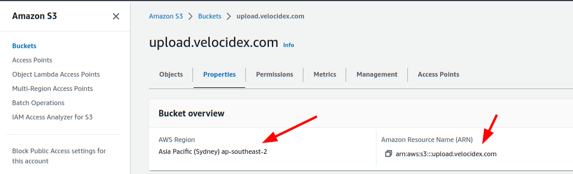

<!-- .slide: class="content" -->

## Uploading offline collections automatically

* Offline collections tend to be very large.
* This makes it difficult to transfer the collection back to the
  investigation team.
* Velociraptor offers a number of automated uploading mechanisms:
  1. SMB Upload (Windows Share)
  2. S3 or GCP uploads
  3. Azure storage service

---

<!-- .slide: class="content" -->

## Configure SMB upload

* Best used in an on-premises network
  * Can use any system on the network to receive the file.
* Need to secure the upload directory:
  * Create a special uploader account
  * Only allow uploader account access to write files.
  * Prevent uploader account from reading files.

---

<!-- content -->
## Exercise: Preparing an SMB dropbox

* Sometimes it is easiest to configure an SMB directory to receive the
  offline collector.

* Follow the
  [instructions](https://docs.velociraptor.app/docs/offline_triage/remote_uploads/#smb-share)
  to configure an SMB drop box folder.

* Create offline collectors to upload to the folder.

---

<!-- .slide: class="content small-font" -->

## Step 1: Creating service account

* Need to create a new local user account to authenticate to the server.


---

<!-- .slide: class="content small-font" -->
## Step 2: Share directory to new user

* Create a directory on the server to accept uploads
* Share the directory


---

<!-- .slide: class="content small-font" -->
## Step 3: Adjust ACLs

* Ensure the service account has limited permission on the NTFS level


---

<!-- .slide: class="content small-font" -->
## Step 4: Test ACLs using VQL

* You can use VQL from the server notebook to ensure the uploader account
   1. Can upload a test file to the SMB share
   2. Can not list or read any files on the SMB share.

```sql
LET SMB_CREDENTIALS <= dict(`192.168.1.112`="uploader:test!password")

SELECT upload_smb(accessor="data",
    file="Hello world",
    name="hello.txt",
    server_address="//192.168.1.112/uploads")
FROM scope()

SELECT *
FROM glob(globs="*",
    root="//192.168.1.112/uploads",
    accessor="smb")
```

---

<!-- .slide: class="content small-font" -->
## Step 5: Creating the SMB collector

* Once we confirm the SMB share is properly configured, we can create
  the collector.


---

<!-- title optional -->

# Collecting to AWS Buckets

---

<!-- content small-font optional -->

## Bucket credentials

* On AWS bucket access is given by user policies
* Basic entities:
  1. A Bucket - contains upload collections
  2. A User - a service account that assumes an identity.
      * The user has credentials (Key and Secret)
      * One or more policy objects associated with the user.
  3. A Policy
      * Specifies permissions to various actions on APIs.

---

<!-- content small-font optional -->

## Creating a bucket

* Using the AWS console create a bucket with default permissions
* The most important parameters are the region and the bucket name



---

<!-- content small-font optional -->

## Creating a User

* In the IAM section of the console create a User account
* Create a dedicated user account that will only be allowed to upload.


---

<!-- content small-font optional -->

## Creating security credentials

* Since this account needs to log in automatically we need to get an access key for it.
* Under the `Security credentials` tab find the `Access Keys` section and create a new key.
* Select `Application running outside AWS` as the type of the key.
* You can now retrieve the key from the console. Make sure to record
  it because it wont be shown again.

---

<!-- full_screen_diagram small-font optional -->

### Creating security credentials


---

<!-- content small-font optional -->

## Creating a policy

* You can attach the policy JSON object to the user account.
* The only permission needed is the `PutObjet` permission on the
  bucket resource.

```json
{
    "Version": "2012-10-17",
    "Statement": [
        {
            "Sid": "VisualEditor0",
            "Effect": "Allow",
            "Action": "s3:PutObject",
            "Resource": "arn:aws:s3:::upload.velocidex.com/*"
        }
    ]
}
```

---

<!-- content small-font optional -->
## Testing the upload credentials

* Gather the following pieces of information
   1. Key ID
   2. Key Secret
   3. Bucket name and region

* Add these to the collector configuration.

---

<!-- full_screen_diagram small-font optional -->
## Testing the upload credentials


---

<!-- content optional -->
## Viewing the contents of the bucket

* While the uploader has no credentials we can create a second service
  account with full access to the bucket.

* This allows the server to view files in the bucket as soon as they
  are uploaded!

* We will use this in the next section to automate post processing.

---

<!-- content small-font optional -->
## Full access policy

* To give the service accout full access use the following policy

```json
{
    "Version": "2012-10-17",
    "Statement": [
        {
            "Sid": "VisualEditor1",
            "Effect": "Allow",
            "Action": "s3:*",
            "Resource": [
                "arn:aws:s3:::upload.velocidex.com/*",
                "arn:aws:s3:::upload.velocidex.com"
            ]
        }
    ]
}
```

---

<!-- content small-font optional -->

## Testing Full access policy

* Using the credentials for the full access s3 service account we can read the bucket.

```sql
LET S3_CREDENTIALS<=dict(
  region="ap-southeast-2",
  credentials_key='CRED_KEY',
  credentials_secret='CRED_SECRET')

SELECT * FROM glob(accessor="s3", globs="**", root="/upload.velocidex.com/")

```
