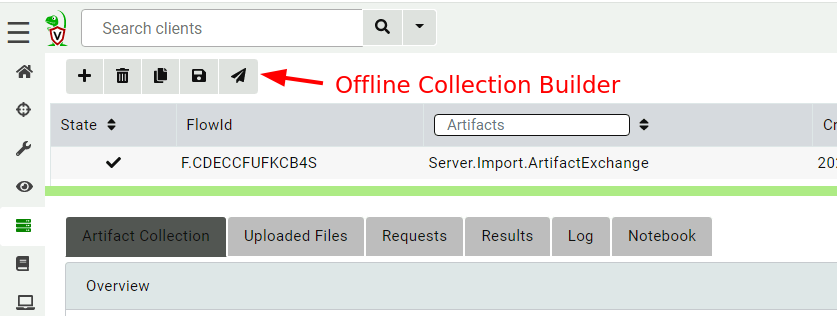
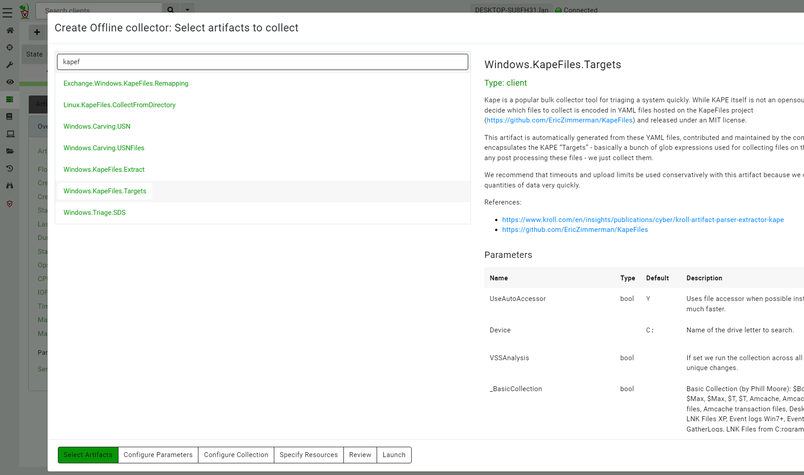
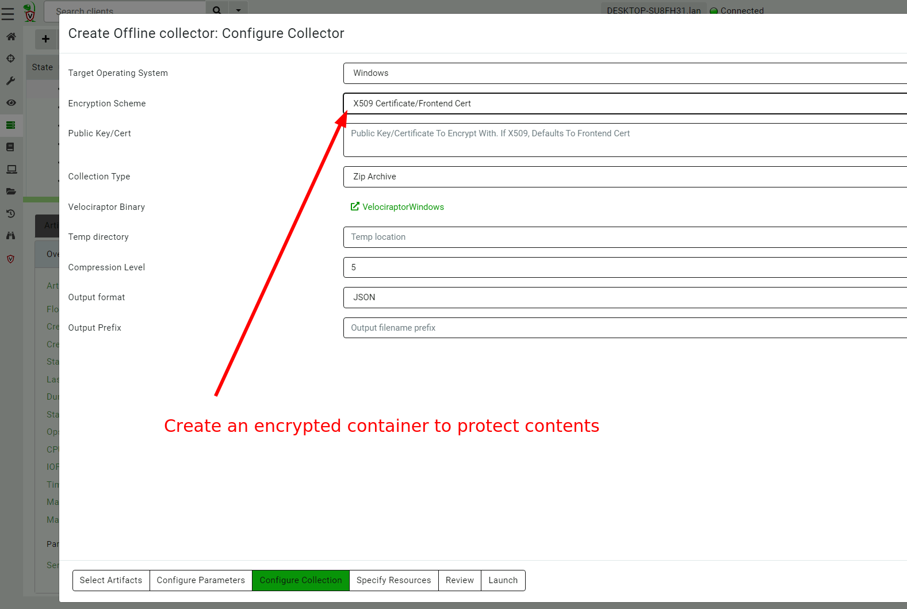
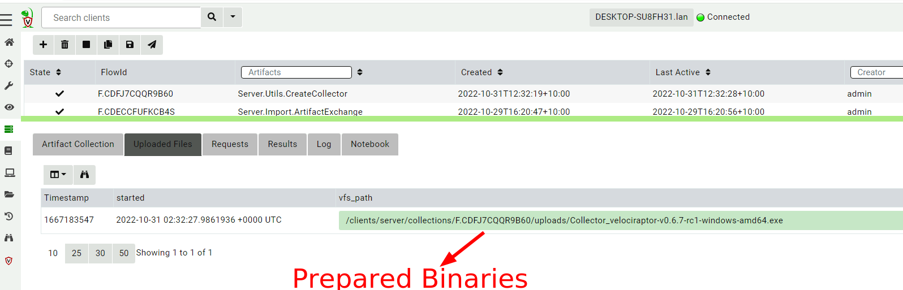
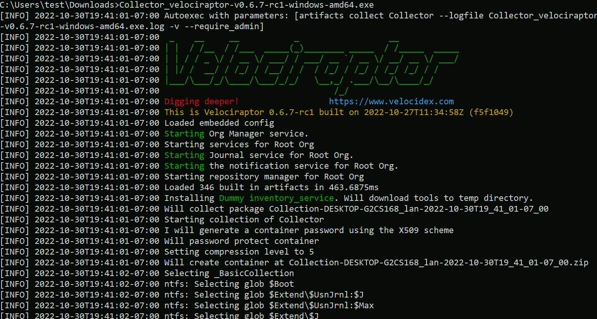
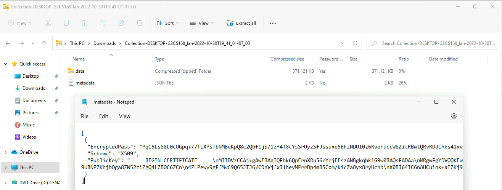
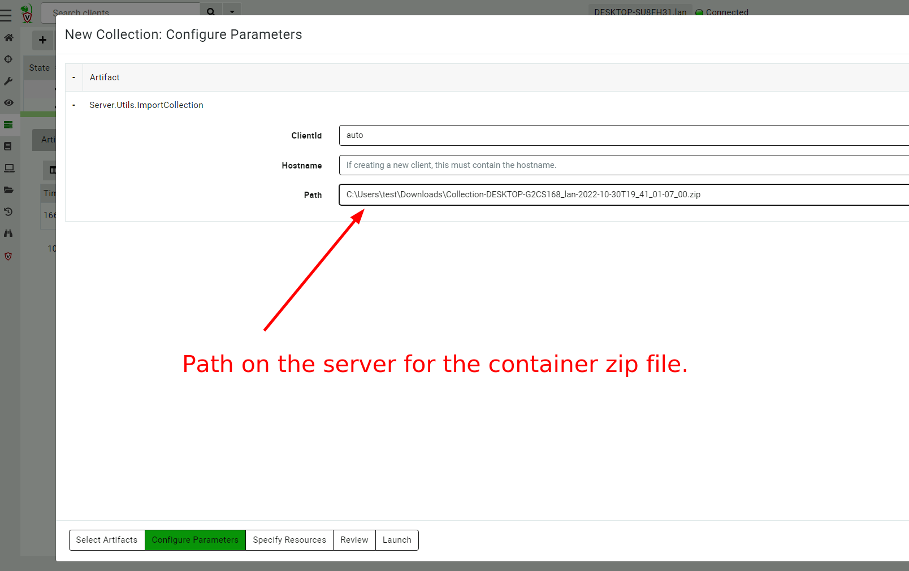
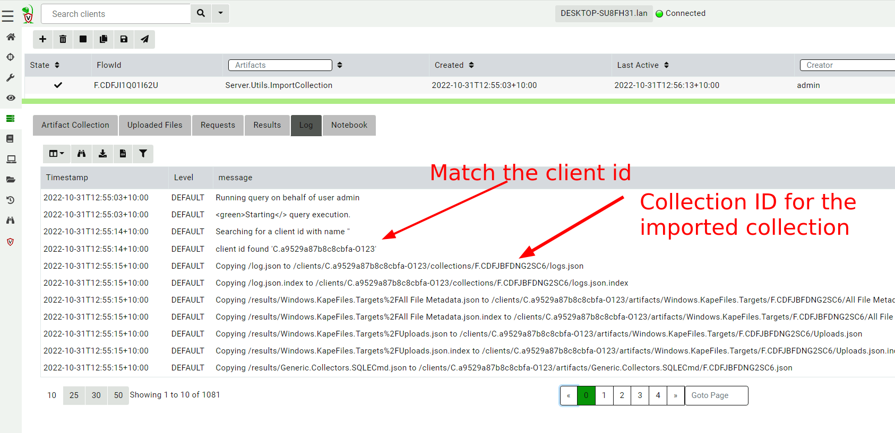
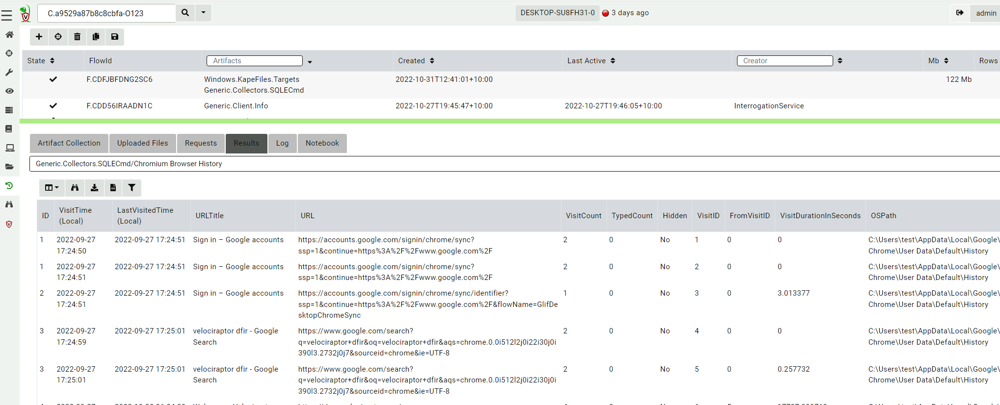

<!-- .slide: class="title" -->

# Offline collections

## Digging deeper without a server

---

<!-- .slide: class="content " -->

## Why Offline collection?

* I want to collect artifacts from an endpoint
* But Velociraptor is not installed on the endpoint!
* Or the endpoint is inaccessible to the Velociraptor server (no
  egress, firewalls etc).

But Velociraptor is just a VQL engine!  It does not really need a
server anyway

---

<!-- .slide: class="content small-font" -->

## Velociraptor Artifacts

* Velociraptor is essentially a VQL engine.
* VQL queries are encapsulated inside an Artifact - a structured yaml
  file describing the query’s purpose and parameters.
* We have seen how to collect artifacts remotely using the
  client/server model - however we can also collect artifacts locally

---

<!-- .slide: class="content" -->
## Why Offline collection?

* I want to collect artifacts from an endpoint
* But Velociraptor is not installed on the endpoint!
* Or the endpoint is inaccessible to the Velociraptor server (no egress, firewalls etc).
* But Velociraptor is just a VQL engine!  It does not really need a server anyway

---

<!-- .slide: class="content" -->
## Create an offline collector

#### Let's select two artifacts to collect:

1. Windows.KapeFiles.Targets
    * Select the Basic Collection to get many forensic artifacts
2. SQLiteHunter: https://github.com/Velocidex/SQLiteHunter

---

<!-- .slide: class="full_screen_diagram" -->

### Selecting the Windows.KapeFiles.Targets artifact

---

<!-- .slide: class="full_screen_diagram" -->

### Configuring the collector to encrypt output

---

<!-- .slide: class="full_screen_diagram" -->

### Downloading the prepared binary

---

<!-- .slide: class="content" -->

## Offline collector binaries

* Preconfigured to collect the required artifacts
* No user interaction needed - just run with no command line args
* Prepare armoured Zip file with all the results in them

---

<!-- .slide: class="full_screen_diagram" -->

### Acquire data!

---

<!-- .slide: class="content" -->

## Acquired file is encrypted

* Due to limitations in the Zip format, file names can not be encrypted.
* Therefore, Velociraptor creates a second protected Zip file inside
  the outer container.
* Several encryption schemes supported:
    1. Regular password
    2. X509 - random password generated and encrypted with the server's certificate.
    3. GPG - random password generated and encrypted with the GPG public key.

---

<!-- .slide: class="content" -->

## Acquired file is encrypted

---

<!-- .slide: class="content" -->

## Importing into Velociraptor

* Velociraptor can automatically decrypted offline containers when
  importing.
* Use the Server.Utils.ImportCollection artifact to import collections
* The server uses its private key to unlock the container automatically.
* This preserves PII and confidential information in transit!

---

<!-- .slide: class="full_screen_diagram" -->

### Import the collection into the Velociraptor server

---

<!-- .slide: class="full_screen_diagram" -->

### Inspect the import process

---

<!-- .slide: class="full_screen_diagram" -->

### Inspect the collected data

---

<!-- .slide: class="content " -->

## Protecting the collection file: Encryption
* For added protection, add a password to the zip file
* If we used a simple password it would be embedded in the collector
* Use an X509 scheme to generate a random password.

* Zip files do not password protect the directory listing - So
  Velociraptor creates a second zip file inside the password protected
  zip.

---

<!-- .slide: class="content " -->

## Including third party binaries

* Sometimes we want to collect the output from other third party
  executables.
* Velociraptor can package dependent binaries together with the
  offline collector.
* Velociraptor can append a zip file to the end of the binary and
  adjust PE headers to ensure it can be properly signed.

---

<!-- content optional -->

## Take a memory image with winpmem

* We will shell out to winpmem to acquire the image. We will bring
  winpmem embedded in the collector binary.

---

<!-- .slide: class="content " -->

## Importing collections into the GUI

* You can import an offline collection into the GUI using the
  `import_collection()` [VQL function](https://docs.velociraptor.app/vql_reference/server/import_collection/).
* Requires the collection ZIP to already be present on the server.
* Decrypts X509 encrypted collections automatically.

---

<!-- .slide: class="content " -->

## Local collection considerations
* Local collection can be done well without a server and permanent
  agent installed.
* A disadvantage is that we do not get feedback of how the collection
  is going and how many resources are consumed.
* We really need to plan ahead what we want to collect and it is more
  difficult to pivot and dig deeper in response to findings.
