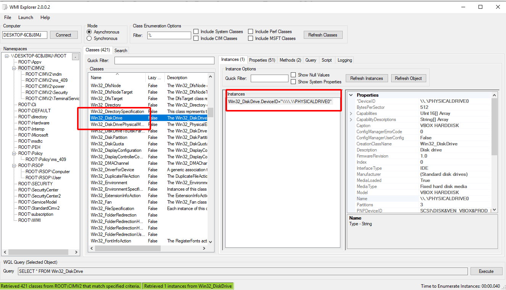
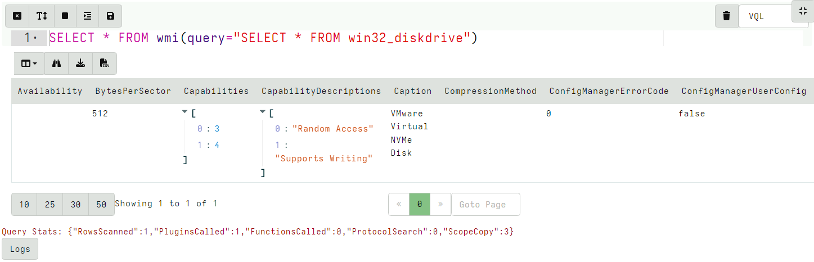

<!-- .slide: class="title" -->

# Event Tracing for Windows

---

<!-- .slide: class="content small-font" -->

## What is ETW

* ETW is the underlying system by which event logs are generated and collected.
https://docs.microsoft.com/en-us/windows-hardware/test/weg/instrumenting-your-code-with-etw


---

<!-- .slide: class="content" -->

## ETW Providers

Show all registered ETW providers

```
logman query providers
```


Show details about each provider

```
logman query providers Microsoft-Windows-DNS-Client
```

---

<!-- .slide: class="content small-font" -->

## ETW for event driven logs

* ETW and event logs are just two sides of the same coin

<div class="container">
<div class="col">

* Log providers are just ETW providers
   * In VQL `watch_etw()` can be used instead of `watch_evtx()

* See `Windows.Sysinternals.SysmonLogForward` for an example

</div>
<div class="col">


</div>

---

<!-- .slide: class="content" -->

## Exercise - Monitor DNS queries

* Use ETW to monitor all clients' DNS queries.

* Stream queries to server

---

<!-- .slide: class="full_screen_diagram" -->

## Exercise - Monitor DNS queries


---


<!-- .slide: class="content" -->

## Windows Management Instrumentation

* A framework to export internal windows state information using a query language (WQL)
* Consists of classes (providers) and objects
* Lots of hooks into many internal system features
* Being able to inspect system state using a consistent interface allows a tool to query a wide range of services.


---

<!-- .slide: class="full_screen_diagram" -->

## WMI Explorer


---

<!-- .slide: class="full_screen_diagram" -->

## WMI Explorer



---

<!-- .slide: class="full_screen_diagram" -->

```sql
SELECT * FROM wmi(query="SELECT * FROM win32_diskdrive")
```



---

<!-- .slide: class="content" -->

## Mutants

* *Malware persistence*: Malware needs to ensure there is only a
  single copy of it running.
* A common method is to use a Mutant (Or named mutex) Create a mutant
  with a constant name: If the named mutant already exists, then exit

* Ensures only a single copy is run.

---

<!-- .slide: class="content" -->

## Exercise - Mutants

```powershell
$createdNew = $False
$mutex = New-Object -TypeName System.Threading.Mutex(
      $true, "Global\MyBadMutex", [ref]$createdNew)
if ($createdNew) {
    echo "Acquired Mutex"
    sleep(100)
} else {
    echo "Someone else has the mutex"
}
```

---

<!-- .slide: class="content" -->

## Enumerate the mutants


---

<!-- .slide: class="content" -->

## Process analysis

* A process is a user space task with a specific virtual memory layout

* A process has a Process ID (Pid), an initial binary on disk, an ACL Token, environment variables etc.

* The process links binaries like `.dll` or `.exe` which can contain metadata such as signatures.

* The process contains working memory which might contain additional data

* Each of these properties can be inspected by Velociraptor

---

<!-- .slide: class="content" -->
## Process Information

Simple `pslist()` can reveal basic information about the process

* Who launched the binary?
* Transfer metrics (network/disk activity)
* Is it elevated?
* Process Creation time

---

<!-- .slide: class="content" -->

## Exercise - Find elevated command shell

* Write an artifact to find all currently running elevated command
shells

* Report how long they have run for

---

<!-- .slide: class="content" -->

## Mapped Memory

* When a binary runs it links many DLLs into it

* A linked DLL is a copy on write memory mapping of a file on disk
  into the process memory space.

* DLLs can be linked when the program starts or dynamically

* DLL Hijacking relies on making a process link the wrong DLL and
  therefore running code under the context of a trusted proces.

---

<!-- .slide: class="full_screen_diagram" -->

## Process memory view


---

<!-- .slide: class="content" -->

## The VAD plugin

* This plugin shows all the process memory regions and if the memory
  is mapped to file, the filename it is mapped from.

* DLLs and .NET assemblies are mapped into the process - so we can use
  this to get an idea of what the program is doing.

---

<!-- .slide: class="content small-font" -->

## Exercise - look into powershell

* Without enabling powershell block logging, we can get an idea of
  what the script is doing by looking at its dependencies.

* Write VQL to list all the DLL modules that powershell is running.

* Run the following command within powershell (this is typical of C&C)
```
Invoke-WebRequest -Uri "https://www.google.com" -UseBasicParsing
```

---

<!-- .slide: class="content" -->

## Dump mapped objects

* Dump the powershell process's mapped DLLs.
* The DLL winhttp.dll is responsible for making outbound http connections.

* If the http request is enabled, the process will link the winhttp.dll at runtime.
* This technique works on many other programs that may load DLLs on demand.
   * e.g. Python
