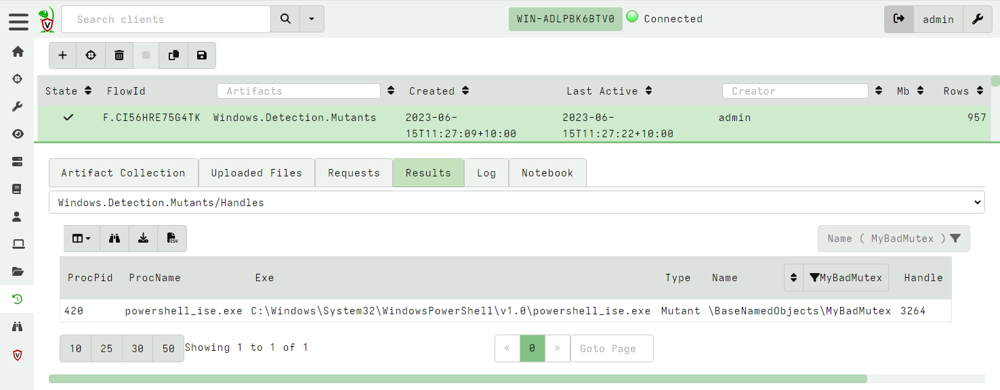

<!-- .slide: class="title" -->

# Processes and Memory analysis

---

<!-- .slide: class="content" -->

## What is a process?

* A process is a user space task with a specific virtual memory layout

* A process has a Process ID (Pid), an initial binary on disk, an ACL
  Token, environment variables etc.

* The process links binaries like `.dll` or `.exe` which can contain
  metadata such as signatures.

* The process contains working memory which might contain additional
  data

* Each of these properties can be inspected by Velociraptor

---

<!-- .slide: class="content" -->
## Process Information

Simple `pslist()` can reveal basic information about the process

* Who launched the binary?
* Transfer metrics (network/disk activity)
* Is it elevated?
* Process Creation time

---

<!-- .slide: class="content" -->

## Exercise - Find elevated command shell

* Write an artifact to find all currently running elevated command
  shells

* Report how long they have run for

---

<!-- .slide: class="content" -->

## Exercise - Find elevated command shell

<div class="solution solution-closed">

```
SELECT Pid,
       Name,
       Username,
       CommandLine,
       Exe,
       now() - CreateTime.Unix AS RunningTime
FROM pslist()
WHERE CommandLine =~ "cmd"
AND TokenIsElevated
```

</div>

---

<!-- .slide: class="content" -->

## Mapped Memory

* When a binary runs it links many DLLs into it

* A linked DLL is a copy on write memory mapping of a file on disk
  into the process memory space.

* DLLs can be linked when the program starts or dynamically

* DLL Hijacking relies on making a process link the wrong DLL and
  therefore running code under the context of a trusted proces.

---

<!-- .slide: class="full_screen_diagram" -->

## Process memory view


---

<!-- .slide: class="content" -->

## The VAD plugin

* This plugin shows all the process memory regions and if the memory
  is mapped to file, the filename it is mapped from.

* DLLs and .NET assemblies are mapped into the process - so we can use
  this to get an idea of what the program is doing.

---

<!-- .slide: class="content small-font" -->

## Exercise - look into powershell

* Without enabling powershell block logging, we can get an idea of
  what the script is doing by looking at its dependencies.

* Write VQL to list all the DLL modules that powershell is running.

* Run the following command within powershell (this is typical of C&C)
```
Invoke-WebRequest -Uri "https://www.google.com" -UseBasicParsing
```

---

<!-- .slide: class="content" -->

## Exercise: Dump mapped objects

* Dump the powershell process's mapped DLLs.
* The DLL `winhttp.dll` is responsible for making outbound http connections.

* If the http request is enabled, the process will link the winhttp.dll at runtime.
* This technique works on many other programs that may load DLLs on demand.
   * e.g. Python

---

<!-- .slide: class="content" -->

## Dumping process memory

* When a binary is running it is mapped into memory


---

<!-- .slide: class="content" -->
## Parsing PE files from memory

* Since a PE file is just mapped into memory we can parse it directly
  from memory.
* This is useful when the process has been unpacked (e.g. malware
  packers).
  * Unpacking the process will fix up the import and export tables
    with the real imports.

---

<!-- .slide: class="content" -->
## Exercise: Find Powershell Module that provides WinHTTP

* Write VQL to locate the Powershell module which provides the WinHTTP
  APIs.
  * Parse the mapped PE files of all dlls into the powershell process.
  * Inspect each dll's export directory to find WinHTTP APIs.

---

<!-- .slide: class="content small-font" -->

## Exercise: Find Powershell Module that provides WinHTTP API

<div class="solution solution-closed">

```
SELECT *, PEInfo.VersionInformation
FROM foreach(row={
    SELECT * FROM pslist()
    WHERE Name =~ "powershell"
}, query={
    SELECT *, parse_pe(accessor="process",
        base_offset=Address, file=str(str=Pid)) AS PEInfo
    FROM vad(pid=Pid)
    WHERE MappingName =~ "dll$"
      AND PEInfo.Exports =~ "WinHttp"
})
```

</div>

---

<!-- .slide: class="content" -->

## Searching memory

* Velociraptor makes process memory available via the `process` accessor.
  * Use the string form of the pid as the filename.
  * Memory is sparse - but the accessor handles this automatically.
  * This means we can scan memory using the regular `yara()` plugin

---

<!-- .slide: class="content" -->

## Exercise: Scan memory for keyword

* Open notepad and write "This is a test" but do not save it anywhere!
* Write VQL to detect this string.

---

<!-- .slide: class="content small-font" -->

## Exercise: Scan memory for keyword

<div class="solution solution-closed">

```

LET Rule = '''
rule X {
    strings:
        $a = "this is a test" wide ascii
    condition: any of them
}
'''

SELECT *
FROM foreach(row={
    SELECT *
    FROM pslist() WHERE Name =~ "notepad"
}, query={
    SELECT * FROM yara(accessor="process",
       files=str(str=Pid), number=1, rules=Rule)
})
```

</div>

---

<!-- .slide: class="content" -->

## Mutants

* *Malware persistence*: Malware needs to ensure there is only a
  single copy of it running.
* A common method is to use a Mutant (Or named mutex) Create a mutant
  with a constant name: If the named mutant already exists, then exit

* Ensures only a single copy is run.

---

<!-- .slide: class="content" -->

## Exercise - Mutants

```powershell
$createdNew = $False
$mutex = New-Object -TypeName System.Threading.Mutex(
      $true, "Global\MyBadMutex", [ref]$createdNew)
if ($createdNew) {
    echo "Acquired Mutex"
    sleep(100)
} else {
    echo "Someone else has the mutex"
}
```

---

<!-- .slide: class="content" -->

## Enumerate the mutants


