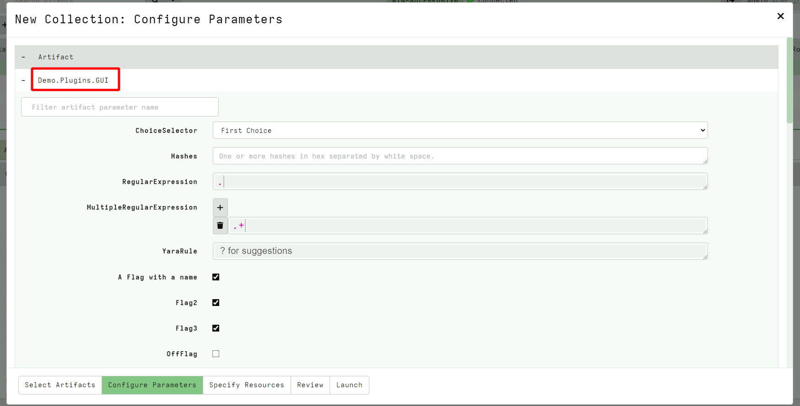
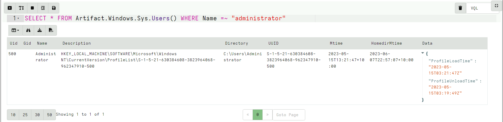

<!-- .slide: class="title" -->

# VQL Artifacts

## Stand alone VQL Programs!


---

<!-- .slide: class="content small-font" -->

## Artifacts: VQL modules

* Artifacts are VQL modules
* VQL is very powerful but it is hard to remember and type a query each time.

* An Artifact is a way to document and reuse VQL queries
* Artifacts are geared towards collection of a single type of information

* Artifacts accept parameters with default values so they can be
  customized on each execution without needing to change any code.

---

<!-- .slide: class="content" -->

## Velociraptor Artifacts

Velociraptor comes with a large number of artifact types
* Client Artifacts run on the endpoint
* Client Event artifacts monitor the endpoint
* Server Artifacts run on the server
* Server Event artifacts monitor for events on the server.

---

<!-- .slide: class="content" -->

## Velociraptor Query Language

Using a query language we can string together different forensic
capabilities to create novel analysis

The Power of Open source!

The [Velociraptor artifact
exchange](https://docs.velociraptor.app/exchange/) is a place for the
community to publish useful VQL artifacts for reuse

---

<!-- .slide: class="full_screen_diagram" -->
## The Artifact Exchange

<div style="text-align: center;">
  

https://docs.velociraptor.app/exchange/

</div>

---

<!-- .slide: class="full_screen_diagram" -->
## Automatically import Exchange


---

<!-- .slide: class="content" -->

## Exercise: Manually import Exchange artifacts

* Import only Windows related Exchange Artifacts.

---

<!-- .slide: class="content small-font" -->

## Manually importing artifact packs

You can manually upload an artifact pack as well (A zip file
containing artifact definitions).


---

<!-- .slide: class="content small-font" -->

## Main parts of an artifact

* `Name`: We can select artifacts by their name
* `Description`: Human readable context around the purpose
* `Parameters`: A set of parameters with default values which users
  can override (Note - All parameters are passed as strings)
* `Sources`: Each source represents a single result table. Artifacts
  may have many sources in which case sources are named.
* `Query`: Velociraptor runs the entire query using the same
  scope. The last query MUST be a SELECT and the others MUST be LET.

---

<!-- .slide: class="content small-font" -->

## The Artifact Repository


---


<!-- .slide: class="content small-font" -->

## Main parts of an artifact


---

<!-- .slide: class="content small-font" -->

## Parameters

* Artifact parameters are sent to the client as strings
* The client automatically parses them into a VQL type depending on
  the parameter's type specification.
* The GUI uses type specification to render an appropriate UI



---

<!-- .slide: class="content small-font" -->

## Parameter types

Currently these are supported:

* `int`, `integer`: The parameter is an integer
* `timestamp`: The parameter is a timestamp
* `csv`: Parameter appears as a list of dicts formatted as a CSV
* `json`: Parameter is a JSON encoded dict
* `json_array`: The parameter is a list of dicts encoded as a JSON blob (similar to csv)
* `bool`: The parameter is a boolean (TRUE/YES/Y/OK)

Check the `Generic.Plugin.Demo` artifacts for all supported types.

---

<!-- .slide: class="content small-font" -->

## Exercise: Create an artifact

Convert our previous VQL to an artifact.

Developing artifacts is easy to do:

* Go to the View Artifacts screen
* Select Add new artifact
* Modify the template, paste your VQL in it.
* When you save the artifact the artifact will be ready for collection.

---

<!-- .slide: class="content small-font" -->

## Make a WMI Subprocess artifact

We generally want to make artifacts reusable:

* Artifacts take parameters that users can customized when collecting
* The parameters should have obvious defaults
* Artifacts have precondition queries that determine if the artifact will run on the endpoint.
* Description field is searchable so make it discoverable...

---

<!-- .slide: class="content small-font" -->

## Final artifact

<div class="solution solution-closed">

```yaml
name: Windows.Detection.WmiSubprocess
description: |
   Detect processes spawned from WMI

type: CLIENT

parameters:
   - name: ProcessName
     default: cmd.exe

sources:
  - precondition:
      SELECT OS From info() where OS = 'windows'

    query: |
        SELECT Name, Pid, Username, CommandLine, {
         SELECT Name, Pid FROM pslist(pid=Ppid)
        } As Parent
        FROM pslist()
        WHERE Name =~ ProcessName AND Parent.Name =~ "Wmi"
```

</div>

---

<!-- .slide: class="content small-font" -->

## Collect artifact from endpoint


---

<!-- .slide: class="content small-font" -->
## Your artifact is ready to collect

Let's create a hunt to find all currently running command shells from
wmi across our entire deployment.


---

<!-- .slide: class="content small-font" -->

## Artifact writing tips

* Use the notebook to write VQL on the target platform.
    * Typically need to run `velociraptor.exe gui`
* Start small - one query at a time
* Inspect the result, figure out what information is available - refine
* Use LET stored queries generously.
    * Break up the query into smaller components

---

<!-- .slide: class="content small-font" -->

## Artifact writing tips

* Use the log() VQL function to provide print debugging.
* Use EXPLAIN for more detailed debugging information.
* Use `format(format="%T %v", args=[X, X])` to learn about a value's type and value


---

<!-- .slide: class="content small-font" -->

## Calling artifacts from VQL

* You can call other artifacts from your own VQL using the “Artifact.<artifact name>” plugin notation.
    * Args to the Artifact() plugin are passed as artifact parameters.
    * When calling artifacts types are not converted and preconditions
      are not considered. Make sure you pass the expected types

```sql
SELECT * FROM Artifact.Windows.Sys.Users() WHERE Name =~ "administrator"
```


---

<!-- .slide: class="content small-font" -->

## VQL and times

* Inside the VQL query, variables have strong types.
   * Usually a type is a dict but sometimes it is a something else
     (Use `format="%T"` or `EXPLAIN` to see the types)

* Timestamps are given as Golang [time.Time](https://golang.org/pkg/time/#Time) types.
* Timestamps have some common methods some of which are accessible from VQL:
    * `Unix`, `UnixNano` - number of seconds since the epoch
    * `Day`, `Minute`, `Month` etc - convert time to days minutes etc.
* Timestamps compare to strings...
* When times are serialized to JSON they get ISO format strings in UTC.

---

<!-- .slide: class="content small-font" -->

## VQL and times

* Use the `timestamp()` function to parse times from epoch seconds,
  strings, winfiletime etc.
* Use the `format` parameter to **parse** times from string based on a
  format string.
* Takes an `epoch` or `string` arg - can be a string or int - tries to
  do the right thing. Most of the time use the `string` arg as that
  will automatically do the right thing.
    * The `timestamp()` will guess the type of time based on the int
      value (for example automatically convert from epoch seconds,
      epoch microseconds, nanoseconds etc).

* Use the now() function to get the current epoch offset in seconds.

---

<!-- .slide: class="content small-font" -->

## Exercise: Identify recent accounts

Write an artifact to identify local accounts logged in since February


---

<!-- .slide: class="content small-font" -->

## Exercise: Identify recent accounts
```sql
SELECT Name, UUID, timestamp(epoch=Mtime) AS LastLogin
FROM Artifact.Windows.Sys.Users()
WHERE LastLogin > "2023-02-01"
```


---

<!-- .slide: class="content small-font" -->

## Format time

* Generally discouraged to format time manually - prefer to use ISO
  format everywhere!
* If you must format time specially use the `format()` function with
  the different members of the `time.Time` object.

Update the previous artifact to format the time like `4 February 2021 10:23:00`

---

<!-- .slide: class="content small-font" -->

## Format time

```sql
LET myFormat(X) = format(format="%v %v %v %v:%v:%v", args=[
   X.Day, X.Month, X.Year, X.Hour, X.Minute, X.Second
])

SELECT myFormat(X=timestamp(epoch=now()))
FROM scope()
```

---

<!-- .slide: class="content small-font" -->

## Scope lifetime and tempfile()

* Scopes have a well defined lifetime.
* Various functions attach `scope destructors` which run when the scope is destroyed.
* Scopes get destroyed when the current query where it was created exists. For example inside a `foreach()` row clause, there is a new scope.

The `tempfile()` function creates a temporary file and automatically
removes it when the scope is destroyed.

---

<!-- .slide: class="content small-font" -->

## Scope lifetime and tempfile()

Correct usage:
```sql
LET tmp <= tempfile()

SELECT * FROM foreach(row={
  SELECT log(message="Created tmpfile " + tmp) FROM scope()
}, query={
  SELECT OSPath FROM stat(filename=tmp)
})
```

---

<!-- .slide: class="content small-font" -->

## Scope lifetime and tempfile()

Incorrect usage:
```sql
SELECT * FROM foreach(row={
  SELECT tempfile() AS tmp FROM scope()
  WHERE log(message="Created tmpfile " + tmp)
}, query={
  SELECT OSPath FROM stat(filename=tmp)
})
```

---

<!-- .slide: class="content small-font" -->

## VQL control structures

* Looping over rows: VQL does not have a JOIN operator - we use the
  foreach plugin

```sql
SELECT * FROM foreach(
    row={ <sub query goes here> },
    query={ <sub query goes here >})
```

The query subquery will be run on each row emitted by the row subquery.

---

<!-- .slide: class="content small-font" -->
## Looping over arrays

Sometimes arrays are present in column data. We can iterate over these
using the foreach plugin

```sql
LET MyArray = (1,2,3,4)

SELECT * FROM foreach(
    row=MyArray,
    query={
        SELECT log(message="My Value is %v", args=_value)
        FROM scope()
    })
```

if row is an array the value will be assigned to "_value" as a special
placeholder.

---

<!-- .slide: class="content small-font" -->

## Conditional: if plugin and function

The `if()` plugin and function allows branching in VQL.

```sql
SELECT * FROM if(
    condition=<sub query or value>,
    then={ <sub query goes here >},
    else={ <sub query goes here >})
```

If the condition is a query it is true if it returns any rows. Then we
evaluate the then subquery or the else subquery.

As usual VQL is lazy - this means that branches that are not taken are
essentially free!


---

<!-- .slide: class="content small-font" -->

## Conditional: switch plugin

The `switch()` plugin allows multiple branching in VQL.

```sql
SELECT * FROM switch(
    a={ <sub query >},
    b={ <sub query >},
    c={ <sub query >})
```

* Evaluate all subqueries in order and when any of them returns rows
  stop evaluating the next ones.

* **Note**: The order of keys is important!

As usual VQL is lazy - this means that branches that are not taken are
essentially free!

---

<!-- .slide: class="content small-font" -->

## Conditional: chain plugin

The `chain()` plugin allows multiple queries to be combined.

```sql
SELECT * FROM chain(
    a={ <sub query >},
    b={ <sub query >},
    c={ <sub query >})
```

Evaluate all subqueries in order and append all the rows together.

If the `async` parameter is given, then each query will run in
parallel.

---

<!-- .slide: class="content small-font" -->

## Aggregate functions

* An aggregate VQL function is a function that keeps state between evaluations.
* State is kept in an Aggregate Context
* Aggregate functions are used to calculate values that consider multiple rows.

Some aggregate functions
* `count()`, `sum()`, `enumerate()`, `rate()`

---

<!-- .slide: class="content small-font" -->

## Example: Count

The `count()` function keeps track of the last number in its aggregate
context.

We can get the row count in that column.

```sql
SELECT count() AS Index, _value AS value
FROM range(start=10, end=20, step=1)
```

---

<!-- .slide: class="content small-font" -->

## GROUP BY clause

* The GROUP BY clause causes VQL to create groups of same value rows.
* Each group shares the same aggregate context - but this is different
  from other groups.
* Groups keep only the last row in that group.


---

<!-- .slide: class="content small-font" -->

## Example: Count all rows

Count all rows of a particular value:

```
SELECT count() AS Count FROM ….
WHERE ….
GROUP BY 1
```

This works because it creates a single aggregate context (since 1 is
always the same value for all rows) and puts all the rows in it. So a
single row will be returned.

---

<!-- .slide: class="content" -->

## Stacking

Count the number of rows of the same value


