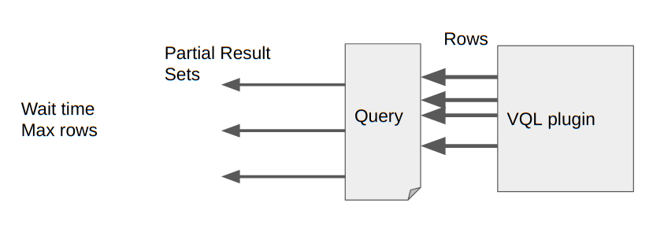
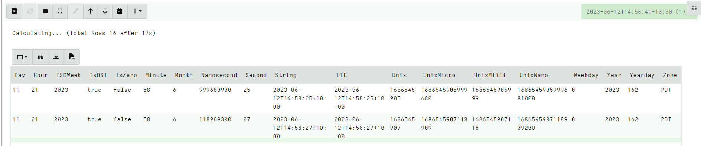
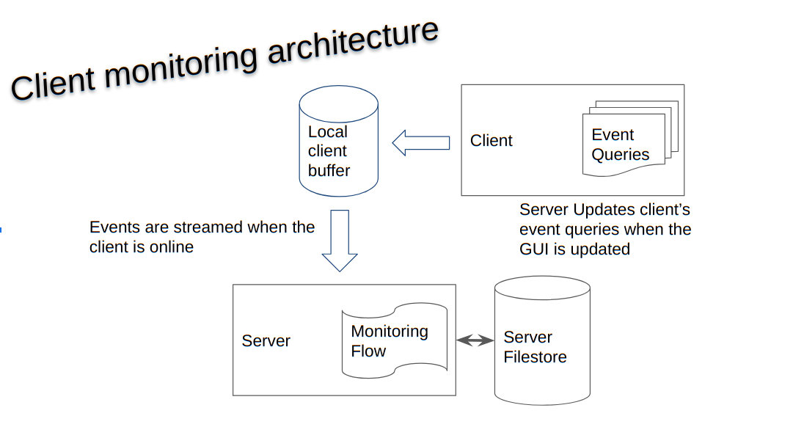

<!-- .slide: class="title" -->

# Event queries and asynchronous VQL

---

<!-- .slide: class="content small-font" -->

## VQL: Event Queries

* Normally a VQL query returns a result set and then terminates.
* However some VQL plugins can run indefinitely or for a long time.
* These are called `Event VQL plugins` since they can be used to
  generate events.
* An Event query does not complete on its own - it simply returns
  partial results until cancelled.

---

<!-- .slide: class="content small-font" -->

## VQL: Event Queries



---

<!-- .slide: class="content small-font" -->

## Playing with event queries

Selecting from `clock()`

```
SELECT * FROM clock()
```



Click the stop button to cancel the query.

```

---

<!-- .slide: class="content small-font" -->

## Client monitoring architecture

* The client maintains a set of VQL Event Queries
* All run in parallel.
* When any of these produce rows, the client streams them to the
  server which writes them to the filestore.
* If the client is offline, these will be queued in the client’s local file buffer.

---

<!-- .slide: class="full_screen_diagram" -->

## Client monitoring architecture



---

<!-- .slide: class="content small-font" -->

## Example event query

```sql
SELECT * FROM watch_evtx(filename="C:/Windows/System32/winevt/logs/system.evtx")
```

Watch the System event log and then clear it. Wait for couple minutes.


