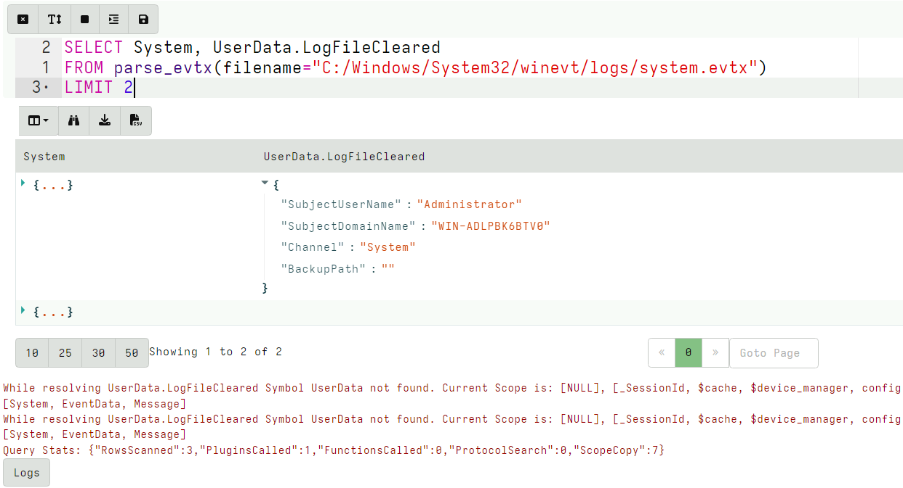
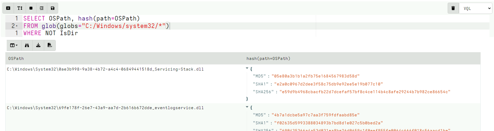
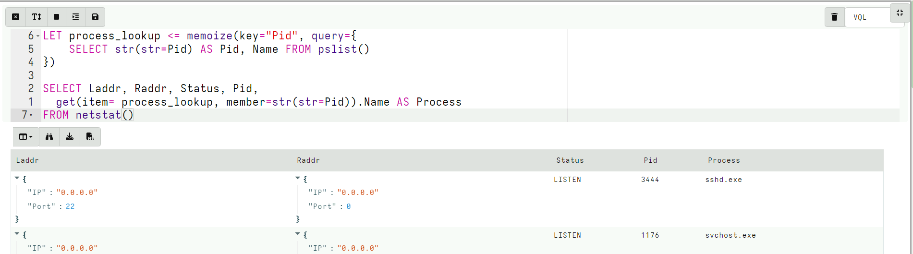
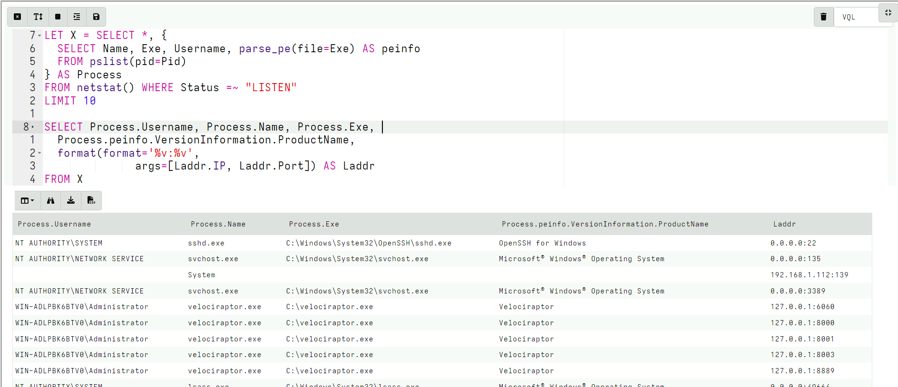
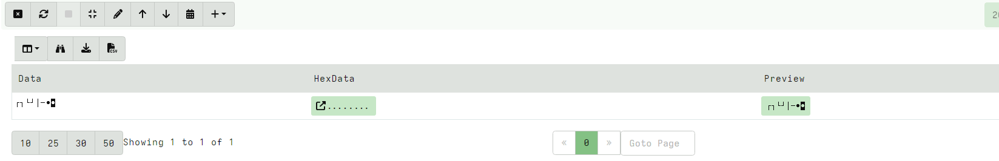
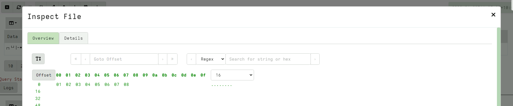

<!-- .slide: class="content small-font" -->

## Why a query language?

* Able to dynamically adapt to changing requirements - without needing
  to rebuild clients or servers.

* For example, a new IOC is released for detection of a specific threat
    1. Immediately write a VQL artifact for the threat, upload the artifact and hunt everywhere for it.
    2. Turn around from IOC to full hunt: A few minutes.
    3. Share artifacts with the community

* VQL Artifacts are simply YAML files with VQL queries.
    1. Can be easily shared and cross pollinate other Artifacts
    2. Can be customized by callers.

Public Artifact Reference [here](https://docs.velociraptor.app/artifact_references//)

---

<!-- .slide: class="content" -->
## VQL - Velociraptor's magic sauce

Rather than having specific analysis modules, VQL allows generic capabilities to be combined in novel creative ways
* NTFS/MFT/USN/Glob file system analysis
* File parsers - Grok, Sqlite etc
* Built in powerful parser framework for novel binary parsers


---

<!-- .slide: class="content small-font" -->

## The notebook - an interactive document

Notebook consist of cells. Click the cell to see its controls.


---

<!-- .slide: class="content small-font" -->
## Add VQL Cell to a new Notebook

* Write the following Query and click Save button.

```sql
SELECT * FROM info()
```

* The GUI will autosuggest to help with the query.
* VQL queries are just tables with rows and columns.

---

<!-- .slide: class="full_screen_diagram small-font" -->

## The notebook - an interactive document

VQL cells evaluate the VQL into a table and write any error messages
or logs under the table.


---

<!-- .slide: class="content small-font" -->

## Completes plugin names


---

<!-- .slide: class="content small-font" -->

## Suggests plugin args

Type ? to show all relevant completions. It also shows documentation
for each option.


---

<!-- .slide: class="content" -->

## Create a local server

* It is possible to use the notebook to learn and experiment with
artifacts.

* Create a local server on your windows system.

```
velociraptor.exe gui
```

* We will use this server's notebook feature to learn about windows
artifacts

---


<!-- .slide: class="content" -->

## What is VQL?

```sql
SELECT X, Y, Z FROM plugin(arg=1) WHERE X = 1
```

* `X, Y, Z` are called Column Selectors
* `plugin(arg=1)` is termed a VQL Plugin with Args
* `X = 1` is the Filter Condition

---

<!-- .slide: class="content small-font" -->

## Plugins

* Plugins are generators of rows
* Plugins accept keyword arguments
* Arguments are strongly typed.
* Some arguments are required, some are optional - check the reference
  to see what is available (VQL will complain!).
* Arguments can be other queries (or stored queries)
* A row is a map of keys (string) and values (objects)
* Values can have many types:
    * Strings, bytes, int64, float64, dicts, arrays

---

<!-- .slide: class="content small-font" -->

## Life of a query

```
SELECT X FROM plugin(arg=1) WHERE X = 1
```

Evaluation steps:

* Evaluate the plugin to produce a *row*
* Wrap the row with a lazy evaluator for each column. Place the column
  in the filter scope.
* Evaluate the filter clause, `X = 1`. If it is true the row will be
  emitted to the result set.
* Emit row to result set (JSON): `{“x”: 1}`

---

<!-- .slide: class="full_screen_diagram small-font" -->


---

<!-- .slide: class="content small-font" -->

## Explaining a query

VQL can explain its operations in detail using the `EXPLAIN` keyword


---

<!-- .slide: class="content small-font" -->

## Explaining a query

VQL can explain its operations in detail using the `EXPLAIN` keyword


---

<!-- .slide: class="content small-font" -->

## Exercise: List running processes

```sql
SELECT * FROM pslist()
```

Narrow processes down to the Velociraptor process

```sql
SELECT * FROM pslist()
WHERE Name =~ "velociraptor"
```

---

<!-- .slide: class="content small-font" -->
## Inspect the data with the table widget

* Show or hide columns
* Export the modified table to CSV or JSON


---

<!-- .slide: class="content small-font" -->
## Inspect the data with the table widget

* Filter or sort using the table widget


---

<!-- .slide: class="content small-font" -->

## Lazy Evaluators

Since many VQL functions can be expensive or have side effects it is
critical to understand when they will be evaluated (i.e. when they
will run).

VQL tries to do as little work as possible so it can be efficient.

A good function is the log() function which outputs a log when it gets
evaluated. We can use this to understand the evaluation order.

---

<!-- .slide: class="content small-font" -->

## Exercise: Evalution and Side effects with log()

Evaluating the log() function returns true and logs the message in the
query log.

* Log function is not evaluated for filtered rows
* When the Log variable is mentioned in the filter condition, it will
  be evaluated only if necessary!

* We can use this property to control when expensive functions are evaluated
   * e.g. `hash()`, `upload()`

---

<!-- .slide: class="content small-font" -->
## Exercise: Evalution and Side effects with log()

In the following queries predict if the log function will be
evaluated.

```sql
SELECT OS, log(message="I Ran 1!") AS Log FROM info()

SELECT OS, log(message="I Ran 2!") AS Log FROM info()
WHERE OS =~ "linux"

SELECT OS, log(message="I Ran 3!") AS Log FROM info()
WHERE Log AND OS =~ "linux"

SELECT OS, log(message="I Ran 4!") AS Log FROM info()
WHERE OS =~ "linux" AND Log

```

---

<!-- .slide: class="content small-font" -->

## Checking the log function output


---

<!-- .slide: class="content small-font" -->

## What is a Scope?

A scope is a bag of names that is used to resolve variables, functions
and plugins in the query.


VQL sees “info” as a plugin and looks in the scope to get the real
implementation

---

<!-- .slide: class="content small-font" -->

## Nested Scopes

Scopes can nest - this allows sub-scopes to mask names of parent
scopes.

VQL will walk the scope stack in reverse to resolve a name.


---

<!-- .slide: class="content small-font" -->

## Scope exercise

* When a symbol is not found, Velociraptor will emit a warning and
  dump the current scope’s nesting level.

* Depending on where in the query the lookup failed, you will get
  different scopes! You can use this to spot typos in the query.

* The top level scope is usually populated by artifact parameters.

---

<!-- .slide: class="content small-font" -->

## Typo Example

```sql
SELECT Hostname, OS, Executabler FROM info()
```


* When the client emits a `Symbol not found` error Velociraptor
  assumes the VQL is faulty and will fail the collection from the
  client!

---

<!-- .slide: class="content small-font" -->

## Unknown column types

* Sometimes we do not know in advance if a certain column exists or
  not - e.g. parsing event logs.



---

<!-- .slide: class="content small-font" -->

## Unknown column types

If we expect that some symbols will not be found, we can suppress the
warnings using the following pattern:

```sql
LET X = scope()

SELECT System, X.UserData.LogFileCleared
FROM parse_evtx(filename="C:/Windows/System32/winevt/logs/system.evtx")
```

---

<!-- .slide: class="content small-font" -->

## VQL Syntax

* Strings denoted by " or ' (escape special characters)
* Multiline raw string is denoted by '''  (three single quotes)
* Subquery delimited by {}
* Arrays delimited by () or []
* You can use (XXX, ) to keep an array distinct from (XXX)

---

<!-- .slide: class="content small-font" -->

## The foreach plugin

* VQL does not have a JOIN operator, instead we have the foreach() plugin.

* This plugin runs one query (given by the `rows` arg), then for each
  row emitted, it builds a new scope in which to evaluate another
  query (given by the `query` arg).

---

<!-- .slide: class="content small-font" -->

## The foreach plugin

```sql
SELECT * FROM foreach(
    row={
        SELECT Exe FROM pslist(pid=getpid())
    },
    query={
        SELECT ModTime, Size, FullPath FROM stat(filename=Exe)
    })
```

* Note how “Exe” is resolved from the produced row since the query is evaluated within the nested scope.

---

<!-- .slide: class="content small-font" -->

## Foreach on steroids!

* Normally foreach iterates over each row one at a time.
* The `foreach()` plugin also takes the workers parameter. If this is
  larger than 1, foreach() will use multiple threads.

* This allows to parallelize the query!

---

<!-- .slide: class="content small-font" -->

## Exercise: Hash all files

```sql
SELECT OSPath, hash(path=OSPath)
FROM glob(globs="C:/Windows/system32/*")
WHERE NOT IsDir
```



---

<!-- .slide: class="content" -->

## Faster hashing!

Convert the previous query to a multi-threaded query using foreach.

---

<!-- .slide: class="content " -->

## Solution

<div class="solution solution-closed">

```sql
SELECT * FROM foreach(row={
    SELECT OSPath
    FROM glob(globs="C:/Windows/system32/*")
    WHERE NOT IsDir
}, query={
    SELECT OSPath, hash(path=OSPath)
    FROM scope()
}, workers=30)
```

</div>

---

<!-- .slide: class="content " -->

## The foreach() column parameter

* A row is really a dict consisting of
   * columns (the dict keys)
   * cells (the dict values)

* Sometimes a query will pass an entire dict in one of the columns.
* In that case we want to use that dict as the row instead of the
  actual row.
* Do this by specifying the `column` parameter

---

<!-- .slide: class="content " -->

## Exercise: Filter columns by name

* Consider the following CSV file

```csv
Column1,Column2,SomethingElse
1,2,3
2,3,4
3,4,5
```

* Write a query that only shows `Column*`

---

<!-- .slide: class="content small-font" -->

## Filtering columns and dicts

```sql
LET CSVFile = '''
Column1,Column2,SomethingElse
1,2,3
2,3,4
3,4,5
'''

LET FilterDict(RowDict) =
  to_dict(item={
    SELECT * FROM items(item=RowDict)
    WHERE _key =~ "Column"
  })

LET GetDictForCSVRow =
  SELECT _value AS RowDict
  FROM items(item={
    SELECT * FROM parse_csv(accessor="data", filename=CSVFile)
  })

SELECT * FROM foreach(row=GetDictForCSVRow,
query={
  SELECT * FROM foreach(row={
    SELECT FilterDict(RowDict=RowDict) AS RebuildDict
    FROM scope()
  }, column="RebuildDict")
})
```

---


<!-- .slide: class="content small-font" -->

## LET expressions

* A stored query is a lazy evaluator of a query which we can store in the scope.
* Where-ever the stored query is used it will be evaluated on demand.

* LET expressions are more readable

```sql
LET myprocess = SELECT Exe FROM pslist(pid=getpid())

LET mystat = SELECT ModTime, Size, FullPath
        FROM stat(filename=Exe)

SELECT * FROM foreach(row=myprocess, query=mystat)
```

Note these are 3 different queries sharing the same scope!

---

<!-- .slide: class="content small-font" -->

## LET expressions are lazy

* Calling pslist() by itself will return all processes.
* The foreach query will quit after 5 rows due to the limit clause
* This cancels the query as soon as we have enough rows!
* Therefore `stat()` will only be run on 5 rows.
* Early exit for expensive plugins

```sql
LET myprocess = SELECT Exe FROM pslist()

LET mystat = SELECT ModTime, Size, FullPath
        FROM stat(filename=Exe)
WHERE log(message="Stat " + Exe)

SELECT * FROM foreach(row=myprocess, query=mystat)
LIMIT 5
```
---

<!-- .slide: class="full_screen_diagram small-font" -->

## LET expressions are lazy


---

<!-- .slide: class="content small-font" -->

## Materialized LET expressions

Sometimes we do not want a lazy expression! VQL calls a query that is
expanded `materialized`. The expanded rows are kept in memory if they
are not too many, otherwise they are written to disk.

Slow approach:

```sql
LET process_lookup = SELECT Pid AS ProcessId, Name FROM pslist()

SELECT Laddr, Raddr, Status, Pid, {
  SELECT Name FROM process_lookup
  WHERE Pid = ProcessId
} AS Process
FROM netstat()
```

---

<!-- .slide: class="content small-font" -->

## Materialized LET expressions


---

<!-- .slide: class="content small-font" -->

## Materialized LET expressions

Materialize the query with <= operator will put the query into memory.

Faster approach:

```sql
LET process_lookup <= SELECT Pid AS ProcessId, Name FROM pslist()

SELECT Laddr, Raddr, Status, Pid, {
  SELECT Name FROM process_lookup
  WHERE Pid = ProcessId
} AS Process
FROM netstat()
```

---

<!-- .slide: class="content small-font" -->

## Materialized LET expressions


All the rows are expanded into memory once and then looked up from
there.

---

<!-- .slide: class="content small-font" -->

## Materialized LET expressions

We can go faster! `Memoize` means to remember the results of a query
in advance

Fastest:
```sql
LET process_lookup <= memoize(key="Pid", query={
    SELECT str(str=Pid) AS Pid, Name FROM pslist()
})

SELECT Laddr, Raddr, Status, Pid,
  get(item= process_lookup, member=str(str=Pid)).Name AS Process
FROM netstat()
```

---

<!-- .slide: class="content small-font" -->

## Materialized LET expressions - fastest



---

<!-- .slide: class="content small-font" -->
## Local VQL functions

* LET expressions can declare parameters.
* This is useful for refactoring functions into their own queries.
* The call site still uses named args to populate the scope.

```sql
LET MyFunc(X) = 5 + X

SELECT MyFunc(X=6) FROM scope()
```


---

<!-- .slide: class="content small-font" -->

## Protocols - VQL operators

* VQL syntax is inspired by Python :-)
* Objects within VQL are strongly typed but dynamic
* Operators interact with objects via “Protocols”
* This means that different objects may do different things for
  different operators - usually they make sense
* If a protocol is not found, VQL substitutes a NULL - VQL does not
  abort the query!

---

<!-- .slide: class="content small-font" -->

## Plugin reference

* VQL is a glue language
* It is quite capable but it is not designed to be able to implement
  arbitrary algorithms
* It relies on VQL plugins and functions to do the heavy lifting while
  VQL combines high level logic

There is a plugin reference on the web site

* Distinction between plugin and funcion
* Search for plugins
* Note required args and their types

---

<!-- .slide: class="content small-font" -->

## Plugin reference site


---

<!-- .slide: class="content small-font" -->

## Writing VQL for fun and profit!

Learn by example: wmi shell

* A common attacker technique is to run remote command shell.

Try it yourself:
```
wmic process call create cmd.exe
```

Let's write an artifact that detects `cmd.exe` launched from WMI

---

<!-- .slide: class="content small-font" -->

## Start small - list processes


See the raw output

---

<!-- .slide: class="content small-font" -->

## View raw JSON data

The Raw JSON shows us what data is available for further VQL processing.


---

<!-- .slide: class="content small-font" -->

## Refine - Filter by name

* The regular expression match operator is `=~`

```sql
SELECT * FROM pslist()
WHERE Name =~ 'cmd.exe'
LIMIT 5
```


---

<!-- .slide: class="content small-font" -->

## Subquery - find parent process

Each process that is shown, we want to show it's parent process. We
can apply a subquery on each row.

```
SELECT *, {
   SELECT * FROM pslist(pid=Ppid)
} As Parent
FROM pslist()
WHERE Name =~ 'cmd.exe'
LIMIT 5
```

---

<!-- .slide: class="content small-font" -->

## Detection: Processes spawned by WMI

Applying a `WHERE` clause will filter out all rows that are not
interesting, leaving rows that should be acted on for detection.

<div class="solution solution-closed">

```
SELECT Name, Pid, Username, CommandLine, {
   SELECT Name, Pid FROM pslist(pid=Ppid)
} As Parent
FROM pslist()
WHERE Name =~ 'cmd.exe' AND Parent.Name =~ "Wmi"
LIMIT 5
```

</div>

---

<!-- .slide: class="content small-font" -->

## Detection: Processes spawned by WMI


Can you think of limitations with this method?

---

<!-- .slide: class="content small-font" -->

## Exercise: Enrich netstat

* Show extra information on all listening processes, including:
    * Binary path on disk
    * User that launched the process
    * Linked DLLs
    * Manufacturer if available
    * Compile time

---

<!-- .slide: class="content small-font" -->

## Step 1: Identify listening processes

```sql
SELECT * FROM netstat() WHERE Status =~ "LISTEN"
```


---

<!-- .slide: class="content small-font" -->

## Step 2: Lookup the process from Pid

```sql
SELECT *, {
  SELECT Name, Exe FROM pslist(pid=Pid)
} AS Process
FROM netstat() WHERE Status =~ "LISTEN"
```


---

<!-- .slide: class="content small-font" -->

## Step 3: Lookup binary information

```sql
SELECT *, {
  SELECT Name, Exe, parse_pe(file=Exe) AS peinfo
  FROM pslist(pid=Pid)
} AS Process
FROM netstat() WHERE Status =~ "LISTEN"
```

---

<!-- .slide: class="content small-font" -->

## Step 3: Lookup binary information


---

<!-- .slide: class="content small-font" -->

## Complete solution

<div class="solution solution-closed">

```
LET X = SELECT *, {
  SELECT Name, Exe, Username, parse_pe(file=Exe) AS peinfo
    FROM pslist(pid=Pid)
} AS Process
FROM netstat() WHERE Status =~ "LISTEN"
LIMIT 10

SELECT Process.Username, Process.Name, Process.Exe,
    Process.peinfo.VersionInformation.ProductName,
    format(format='%v:%v',
           args=[Laddr.IP, Laddr.Port]) AS Laddr
FROM X
```

</div>

---

<!-- .slide: class="content small-font" -->

## Complete solution



---

<!-- .slide: class="content small-font" -->

## Column formatting

* VQL treats rows as JSON objects. Cell values are just JSON types.
* Sometimes the type of the column requires specialized viewing.
* The GUI can take hints about how to display each column.
* In the notebook

```
LET ColumnTypes <= dict(ClientId="client",  Base64Data="base64hex")
```

* In an artifact:

```yaml
column_types:
 ClientId: client
 Base64hex: base64hex
```

---

<!-- .slide: class="content small-font" -->

## Example: Display hex data in the GUI

```sql
LET Data = unhex(string="0102030405060708")
LET ColumnTypes <= dict(HexData="base64hex", Preview="preview_upload")

SELECT Data, base64encode(string=Data) AS HexData,
    upload(accessor="data", file=Data) AS Preview
FROM scope()
```

* [Column Types](https://github.com/Velocidex/velociraptor/blob/master/gui/velociraptor/src/components/core/table.jsx):
  * `number`, `mb`, `timestamp`, `nobreak`, `tree`, `url`, `safe_url`,
    `flow`, `preview_upload`, `client`, `client_id`, `base64hex`

---

<!-- .slide: class="content small-font" -->

## Example: Display hex data in the GUI




